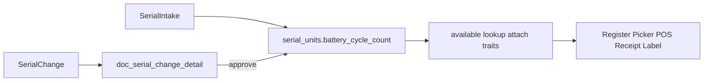

# Battery Cycle Count — Plan Lengkap

## Keputusan terkunci

- Nama kolom/API/FE: **`battery_cycle_count`** (bukan `battery_cycle` di design doc lama)
- Tipe: **`unsignedInteger` nullable di DB** (unit lama tetap valid), **wajib di API + form** intake & Serial Change — pola sama dengan `battery_health`
- Validasi: `required|integer|min:0` (tanpa max ketat; cycle bisa ribuan)
- Scope: **paritas penuh dengan `battery_health`** (bukan hanya core)

---

## Gap analysis (inventaris sebelumnya vs audit `battery_health`)

| Status | Item |
|--------|------|
| Sudah ter-cover | Migration `serial_units` + model; intake trait/controller; Serial Change model/trait/approve; register/export; picker; POS; receipt PDF/ESC/POS; shift; label; StrukOnline; PerNota; docs; seeders; tes utama |
| **Gap yang harus masuk plan** | [`ApproveSerialChangeAction.php`](syilex/app/Actions/SerialChange/ApproveSerialChangeAction.php) (apply + snapshot `before`) — wajib, bukan “via trait saja” |
| **Gap yang harus masuk plan** | Helper tes di [`MasterDownstreamGuardTest`](syilex/tests/Feature/Master/MasterDownstreamGuardTest.php), [`ResetSerialTest`](syilex/tests/Feature/Reset/ResetSerialTest.php), [`PurchaseReportSerialTest`](syilex/tests/Feature/PurchaseReport/PurchaseReportSerialTest.php), [`SerialUnitRegisterTest`](syilex/tests/Feature/SerialUnit/SerialUnitRegisterTest.php) — payload unit tanpa field baru akan **422** setelah validasi wajib |
| **Gap yang harus masuk plan** | Migration **`doc_serial_change_detail`** (kolom mirror) — sama pola `battery_health` di create detail table |
| Bukan gap (sengaja di luar) | [`useSalesInvoicePdf.js`](syilex-frontend/src/composables/useSalesInvoicePdf.js) — hari ini hanya `grade`, **tidak** menampilkan `battery_health` |
| Bukan gap | [`SalesPerNotaExport`](syilex/app/Exports/SalesPerNotaExport.php) — hanya KI + SN |
| Bukan gap | [`BackofficeSalesReturnController`](syilex/app/Http/Controllers/Api/V1/BackofficeSalesReturnController.php) — select hanya `grade` |
| Bukan gap | Transfer/Adj/Opname/SalesReturn/PurchaseReturn detail UI — hanya tampilkan `grade` (+ SN/KI), bukan battery |
| Bukan gap | `public/assets/*.js` hashed build — ikut rebuild FE, jangan edit manual |
| Bukan gap | Import unit serial Excel — belum ada di runtime (hanya spek di `elektronik-serialized.md`) |
| Bukan gap | E2E `serial-picker-loop-proof` — tidak isi atribut battery |

**Kesimpulan:** rencana “A penuh” lengkap jika checklist di bawah diikuti; gap nyata hanya approve action + migration detail + fixture tes downstream.

---

## Checklist implementasi (urutan)

### 1. Database

- Migration baru `serial_units.battery_cycle_count` → `unsignedInteger()->nullable()->after('battery_health')`
- Migration baru `doc_serial_change_detail.battery_cycle_count` → sama (nullable)

### 2. Models

- [`SerialUnit.php`](syilex/app/Models/SerialUnit.php) — `$fillable` + cast `integer`
- [`DocSerialChangeDetail.php`](syilex/app/Models/DocSerialChangeDetail.php) — `$fillable` + cast `integer`

### 3. Write path BE

- [`HandlesSerialUnits.php`](syilex/app/Actions/SerialIntake/Concerns/HandlesSerialUnits.php) — map saat create units
- [`HandlesSerialChangeUnits.php`](syilex/app/Actions/SerialChange/Concerns/HandlesSerialChangeUnits.php) — detail + `before` JSON
- [`ApproveSerialChangeAction.php`](syilex/app/Actions/SerialChange/ApproveSerialChangeAction.php) — update unit + re-snapshot `before`

### 4. Validation + SELECT/payload API

- [`SerialIntakeController.php`](syilex/app/Http/Controllers/Api/V1/SerialIntakeController.php) — `units.*.battery_cycle_count` => `required|integer|min:0`
- [`SerialChangeController.php`](syilex/app/Http/Controllers/Api/V1/SerialChangeController.php) — rules + SELECT editable units
- [`SerialUnitController.php`](syilex/app/Http/Controllers/Api/V1/SerialUnitController.php) — `available()` columns + `serialUnitSummary()`
- [`PosController.php`](syilex/app/Http/Controllers/Api/V1/PosController.php) — shift `serial_units_sold` select + map
- [`AttachesSerialUnits.php`](syilex/app/Http/Controllers/Concerns/AttachesSerialUnits.php) — `$serialReceiptFields`
- [`AttachesSerialUnitsToDocDetails.php`](syilex/app/Http/Controllers/Concerns/AttachesSerialUnitsToDocDetails.php) — SELECT + `$fields`
- [`SalesReturnController.php`](syilex/app/Http/Controllers/Api/V1/SalesReturnController.php) — SELECT unit attrs (sudah punya battery_health)

### 5. Export / seeder / docs

- [`SerialUnitExport.php`](syilex/app/Exports/SerialUnitExport.php) — heading + map (setelah Health)
- [`SerialSampleSeeder.php`](syilex/database/seeders/SerialSampleSeeder.php)
- [`serial.md`](syilex/docs/modules/serial.md) — daftar atribut + field Serial Change
- [`elektronik-serialized.md`](syilex/docs/modules/elektronik-serialized.md) — selaraskan nama ke `battery_cycle_count`

### 6. Frontend (input wajib)

- [`SerialIntakeFormPage.vue`](syilex-frontend/src/views/inventory/SerialIntakeFormPage.vue) — state, validasi wajib, kolom InputNumber, payload
- [`SerialChangeFormPage.vue`](syilex-frontend/src/views/master/SerialChangeFormPage.vue) — sama

### 7. Frontend (tampil / PDF / print — paritas battery_health)

- [`SerialIntakePage.vue`](syilex-frontend/src/views/inventory/SerialIntakePage.vue) — detail + PDF col
- [`SerialChangePage.vue`](syilex-frontend/src/views/master/SerialChangePage.vue) — diff lama→baru
- [`SerialUnitRegisterPage.vue`](syilex-frontend/src/views/inventory/SerialUnitRegisterPage.vue) — list + PDF
- [`SerialUnitPicker.vue`](syilex-frontend/src/components/common/SerialUnitPicker.vue) — `batteryText` / kolom (mis. `Health · Cyc 142`)
- [`PosKasirPage.vue`](syilex-frontend/src/views/pos/PosKasirPage.vue) — cart label, serial card, ambiguous list
- [`useReceiptPdf.js`](syilex-frontend/src/composables/useReceiptPdf.js), [`useReceiptEscPos.js`](syilex-frontend/src/composables/useReceiptEscPos.js) — meta `Cyc N`
- [`useShiftReport.js`](syilex-frontend/src/composables/useShiftReport.js), [`ShiftReportDialog.vue`](syilex-frontend/src/components/pos/ShiftReportDialog.vue)
- [`SerialLabelPrintDialog.vue`](syilex-frontend/src/components/common/SerialLabelPrintDialog.vue) — string `spek`
- [`StrukOnlinePage.vue`](syilex-frontend/src/views/public/StrukOnlinePage.vue), [`PerNotaPage.vue`](syilex-frontend/src/views/laporan/penjualan/PerNotaPage.vue)

Label tampilan: **Cycle** / `Cyc {n}` (singkat di struk thermal).

### 8. Tests

- [`SerialIntakeTest`](syilex/tests/Feature/SerialIntake/SerialIntakeTest.php) — `fillUnits` default + assert store + reject missing/negative
- [`SerialChangeTest`](syilex/tests/Feature/SerialChange/SerialChangeTest.php) — `unitPayload` + before/after + validation
- [`SerialUnitExportTest`](syilex/tests/Feature/SerialIntake/SerialUnitExportTest.php)
- [`SerialSalesCheckoutTest`](syilex/tests/Feature/Serial/SerialSalesCheckoutTest.php) — receipt field list bila di-assert
- Fixtures: MasterDownstreamGuard, ResetSerial, PurchaseReportSerial, SerialUnitRegister

Jalankan filter: `SerialIntake|SerialChange|SerialUnit|SerialSalesCheckout|SerialUnitExport`.

---

## Catatan perilaku setelah deploy

- Unit stok lama: `battery_cycle_count = null` → tetap bisa dijual; tampilan skip nilai kosong
- Intake baru / Serial Change: **wajib diisi** (422 / validasi FE)
- Tidak perlu backfill otomatis
