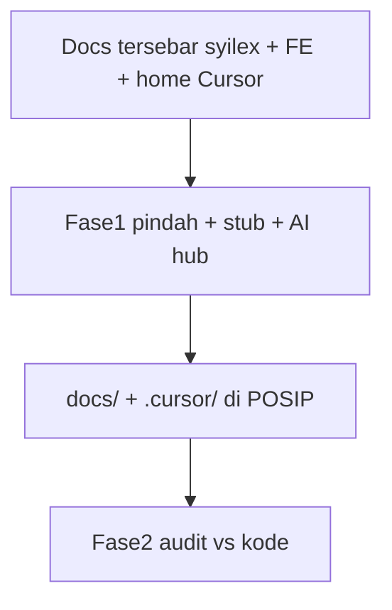

# Konsolidasi dokumentasi ke root POSIP

## Keputusan (dari user)

- **AI:** project rules + skill relevan POSIP di `.cursor/skills/` + plan Cursor terkait POSIP ke `docs/plans/`
- **Urutan:** Fase 1 = pindah/rapikan struktur; Fase 2 = audit/rewrite isi berdasar kodebase

## Target struktur

```text
POSIP/
  README.md                 # monorepo entry → link docs/
  AGENTS.md                 # entry Cursor (ringkas, always-on pointer)
  CLAUDE.md                 # thin pointer → docs/ai/CLAUDE.md (kompat Claude Code)
  .cursor/
    rules/                  # .mdc alwaysApply / globs
    skills/                 # salinan skill relevan saja
  docs/
    README.md               # index hub
    ai/                     # CLAUDE penuh (dipindah + path diperbaiki)
    architecture/
    api/
    modules/
    deploy/
    testing/
    frontend/               # e2e/unit README ringkas kalau dipindah
    plans/                  # plan Cursor terkait POSIP saja
    assets/screenshots/     # sudah ada — tetap
```

## Fase 1 — pindah (tidak rewrite isi dalam)

### 1. Pindahkan markdown produk

| Dari | Ke |
|------|-----|
| [syilex/ARCHITECTURE.md](syilex/ARCHITECTURE.md) | `docs/architecture/ARCHITECTURE.md` |
| [syilex/API_DOCS.md](syilex/API_DOCS.md) | `docs/api/API_DOCS.md` |
| [syilex/ONBOARDING.md](syilex/ONBOARDING.md) | `docs/onboarding/ONBOARDING.md` |
| [syilex/DEPLOY.md](syilex/DEPLOY.md), [INSTALL-SHARED-HOSTING.md](syilex/INSTALL-SHARED-HOSTING.md), [RESTORE_DRILL.md](syilex/RESTORE_DRILL.md) | `docs/deploy/` |
| [syilex/docs/modules/*](syilex/docs/modules/) | `docs/modules/` |
| [syilex/docs/testing/*](syilex/docs/testing/) | `docs/testing/` |
| [syilex/CLAUDE.md](syilex/CLAUDE.md) | `docs/ai/CLAUDE.md` |
| [syilex-frontend/e2e/README.md](syilex-frontend/e2e/README.md), [tests/README.md](syilex-frontend/tests/README.md) | `docs/frontend/` (salin; biarkan stub pointer di tempat lama) |

### 2. Stub di lokasi lama

- [syilex/README.md](syilex/README.md) → singkat + link `../docs/`
- Hapus/ganti file yang dipindah dengan stub 5–10 baris “pindah ke …” (hindari broken bookmark)
- Frontend README/CHANGELOG/LICENSE **tetap** di paket (bukan hub produk); e2e/tests README diganti stub → `docs/frontend/`

### 3. Root monorepo

- Buat [README.md](README.md) root: apa itu POSIP, `syilex` + `syilex-frontend`, link `docs/README.md`
- Buat [docs/README.md](docs/README.md) index lengkap

### 4. AI agent di dalam repo

- [AGENTS.md](AGENTS.md): aturan singkat + pointer ke `docs/ai/CLAUDE.md` + `docs/`
- [CLAUDE.md](CLAUDE.md) root: 1 layar pointer ke `docs/ai/CLAUDE.md`
- `.cursor/rules/` (dari CLAUDE, dipecah ringkas ≤~50 baris / rule):
  - `posip-core.mdc` (`alwaysApply: true`) — SSoT kode, no assume, reuse common, permission
  - `posip-backend.mdc` — globs `syilex/**`
  - `posip-frontend.mdc` — globs `syilex-frontend/**`
- Di Fase 1: **perbaiki path** di `docs/ai/CLAUDE.md` yang jelas salah (`sipos-frontend` → `syilex-frontend`, path Laragon) tanpa rewrite isi penuh

### 5. Skills (salin, tidak symlink)

Salin ke `.cursor/skills/` hanya:

- `ponytail`, `ponytail-review`, `ponytail-audit`, `ponytail-debt`, `ponytail-help`, `ponytail-gain`
- `primevue-skilld`
- `product-ui-design`
- `office-web-ui-system`

**Tidak** disalin: htmx, golang, supabase, graphify (bukan stack inti POSIP).

Sumber: `C:\Users\SAM PUJO\.cursor\skills\<name>\`

### 6. Plans POSIP → `docs/plans/`

Salin dari `C:\Users\SAM PUJO\.cursor\plans\` yang jelas terkait POSIP/syilex (contoh dari nama: `header_gate_*`, `line_duplicate_*`, `penjualan_*`, `pbs_*`, `full_app_deep_audit_*`, `full_menu_deep_tests_*`, `ux_serial_*`, `master_ui_*`, `pengaturan_audit_*`, `return_*`, `unify_return_*`, `battery_*`, `verify_audit_*`).

**Tidak** salin plan proyek lain (synthera, godist, nfc, nd6, woocommerce, dll.).

Tambah `docs/plans/README.md` daftar singkat.

### 7. Out of scope Fase 1

- `graphify-out/` — biarkan; jangan masuk `docs/`
- Rewrite mendalam API/ARCHITECTURE/modul
- Commit git (hanya jika user minta nanti)

## Fase 2 — grounded on codebase (setelah Fase 1)

Urutan audit (kode = truth):

1. `docs/ai/CLAUDE.md` + `.cursor/rules` vs AppMenu, router, permissions, common components
2. `docs/modules/*` vs fitur serial/promo aktual
3. `docs/architecture` + `docs/api` vs routes/controllers
4. `docs/testing` ledger vs suite e2e/unit yang ada
5. Tandai gap: doc usang → perbaiki atau hapus bagian salah; fitur tanpa doc → stub “TODO dokumen”

Fase 2 **bukan** bagian eksekusi pertama; dikerjakan setelah user konfirmasi Fase 1 selesai.

## Alur



## Verifikasi Fase 1

- Tidak ada markdown produk “hidup” tersisa hanya di `syilex/` kecuali stub/README paket
- `docs/README.md` meng-index semua folder
- AGENTS.md / CLAUDE.md root resolve
- `.cursor/skills` berisi 9 skill di atas
- `docs/plans` hanya plan POSIP
- Link internal di stub tidak 404
