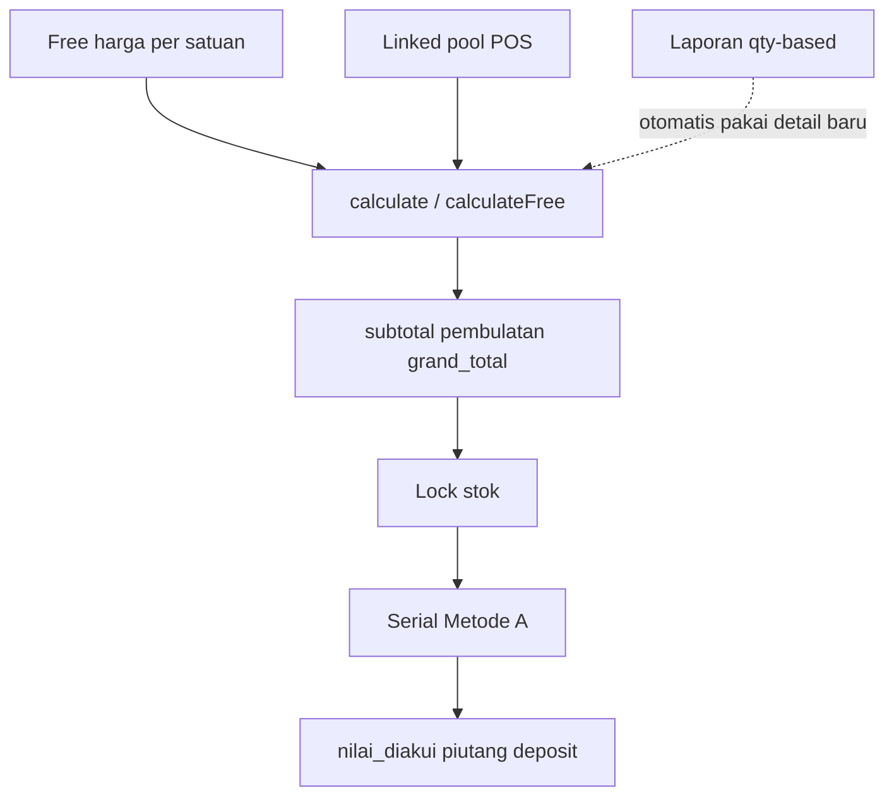

# Retur jual BO: parity POS (uang + HPP serial + UX)

## Keputusan terkunci

1. Free — harga jual **per satuan**; serial UNIT/`harga_1` atau rata `harga_jual` SN.
2. Linked — pool POS: `total_setelah_diskon × (1+pajak%)` (tanpa biaya & pembulatan **nota asal**); pembulatan **baru** di dokumen retur.
3. Lock serial — `recomputeSerialAvgCost` (Metode A) seperti POS; non-serial: restore `avg_cost` jika 0 (mirror POS, kecil).
4. Empty-returnable Message — ya.
5. Settlement BO — tetap `nilai_diakui` → piutang → deposit (bukan kas POS).
6. Draft lama — tidak migrasi massal.

---

## Audit sisa (laporan & lainnya)

### Laporan — aman, tidak ubah formula

| Area | Kenapa OK |
|------|-----------|
| `sqlSalesReturnedBase` / per-nota | Berbasis **qty** + `sales_id` + status lock/approved; free memang tidak masuk per-nota |
| Sales per-barang / export | `qty_retur` saja; pendapatan dari sales nett |
| Gross profit / retur pattern | Pakai detail retur `harga_satuan×qty` — otomatis ikut angka baru setelah formula diganti; **cukup regresi**, jangan rewrite report |
| Margin per barang | Master harga/HPP, bukan dokumen retur |
| Dashboard pending retur | Count status, independen formula |

### MUST (sudah di plan)

- `SalesReturnCalculationService` pool + rounding
- Create/Update persist triad
- Lock Metode A
- Rewrite tes charge + `without_hpp_change`
- FE preview + empty Message

### SHOULD (ditambah ke plan setelah audit)

- **Docs kontradiktif** — [`CLAUDE.md`](syilex/CLAUDE.md) / [`ARCHITECTURE.md`](syilex/ARCHITECTURE.md) / serial docs bilang “SALES_RETURN tidak boleh ubah HPP” → bedakan non-serial vs **serial Metode A wajib** (POS sudah begitu).
- **SalesReturnPage** — tampilkan `pembulatan` bila ≠ 0; hilangkan noise DPP/pajak 0 di detail retur.
- **Non-serial avg=0 restore** di lock (kecil, mirror POS).
- Regresi assert: retur linked **tidak** mengkredit biaya invoice (implisit di rewrite tes).

### YAGNI (tetap di luar)

- Endpoint preview `POST /calculate` khusus BO retur (FE cukup mirror rounding settings; save tetap SSOT backend)
- E2E penuh lock/approve (opsional smoke; bukan blocker)
- PDF/struk BO retur (belum ada — jangan buat)
- Permission baru / ubah deposit-piutang pages
- VerifyDataInvariants formula harga
- Settlement kas POS
- Retur beli / PBS rumus

---

## Implementasi

### A — FE free harga per satuan
[`SalesReturnFormPage.vue`](syilex-frontend/src/views/penjualan/SalesReturnFormPage.vue)

### B — Pool POS + rounding
[`SalesReturnCalculationService`](syilex/app/Services/SalesReturnCalculationService.php) → Create/Update actions

### C — Lock Metode A (+ avg=0 non-serial)
[`LockSalesReturnAction`](syilex/app/Actions/SalesReturn/LockSalesReturnAction.php) + rewrite tes

### D — UX
Empty Message API+FE; ringkasan pembulatan; detail list page

### E — Docs + tes
CLAUDE / ARCHITECTURE / `docs/modules/serial.md`; `BackofficeSalesReturnTest` + mirror `ProcessSalesReturnActionTest`; jalankan BO+POS suites

