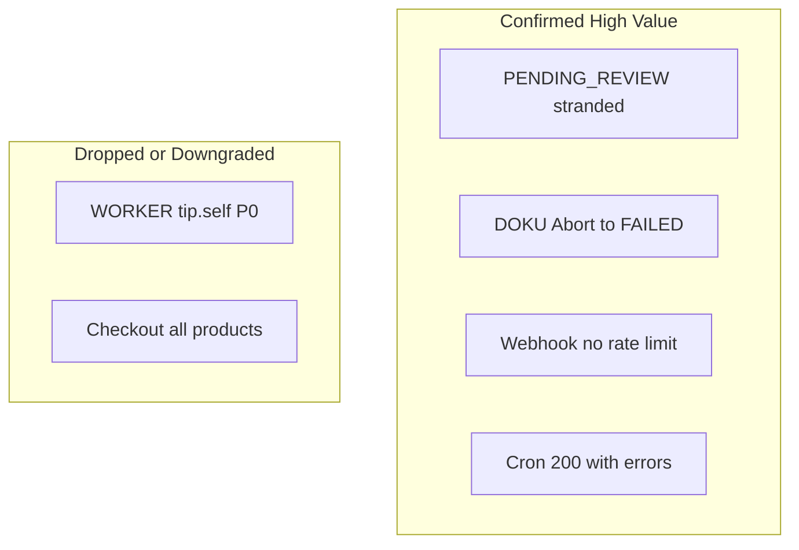

# Audit Mendalam POSTITIK (terverifikasi)

## Verifikasi ulang (anti false positive)

Dicek ulang terhadap kode aktual setelah audit awal.

### False positive / overstated — diturunkan atau dibuang

| Temuan awal | Verdict | Alasan |
|-------------|---------|--------|
| **P0 WORKER tip.self ↔ redirect loop** | **Overstated → P2 latent** | UI Hak Akses hanya `ADMIN/CASHIER/OTHER` ([permissions/page.tsx](src/app/(admin)/permissions/page.tsx)); WORKER tidak bisa diedit di UI. Loop hanya jika POST API `role=WORKER` tanpa `tip.self`. Default `DEFAULT_CAPS.WORKER` tetap `tip.self`. |
| Checkout load **semua produk** | **FP sebagian** | [pos-cart-lines.ts](src/lib/pos-cart-lines.ts) sudah `id: { in: productIds }` keranjang. Yang benar: **semua addon aktif** + **semua cashier** merchant ([validate-cart.ts](src/lib/checkout/validate-cart.ts) L30–33). |
| Strip money API+UI ganda = wajib hapus | **Soft FP** | Defense-in-depth wajar; jangan prioritas. |
| Panel HTML cookie-only = bug keamanan | **By design / P2** | API tetap otoritatif; bukan IDOR. |
| Kill switch CSRF/Bearer | **Ops risk P2** | Bukan bug default; risiko misconfig deploy. |
| Circuit breaker wajib Fase A | **Premature** | Timeout+ambiguous+reconcile sudah ada; breaker = Fase E ops-driven. |

### Confirmed valid (tetap di backlog)

| Temuan | Severity revisi | Bukti singkat |
|--------|-----------------|---------------|
| Ambiguous timeout → `PENDING_REVIEW:` reason, tanpa gateway ID; blocked re-dispatch + reconcile butuh disbursement ID → stranded | **Critical** | [payout-core.ts](src/lib/payout-core.ts) L203–213; [payout-status.ts](src/lib/payout-status.ts) L46–59; [payout-reconcile.ts](src/lib/payout-reconcile.ts) L41–42 |
| Dispatch tanpa atomic claim (race dual createDisbursement) | **High** (Duitku lebih parah; Xendit ada idempotency) | Read → call PG → update, tanpa claim `updateMany` |
| DOKU SNAP `AbortError` tidak jadi `DokuError(504)` → bukan ambiguous → **FAILED** | **High** | [snap-client.ts](src/lib/payment-gateway/providers/doku/snap-client.ts); Xendit/Duitku wrap TIMEOUT |
| Webhooks tanpa `rateLimit` | **P1** | Grep `src/app/api/webhooks` = zero `rateLimit` |
| Owner tip-payout tanpa RL; worker punya 12/min | **P1** | [payout-tip/route.ts](src/app/api/merchant/cashiers/[id]/payout-tip/route.ts) vs [worker/payout](src/app/api/worker/payout/route.ts) |
| Tip payout tanpa `logActivity` | **P1** | Owner payout-tip tidak memanggil logActivity |
| Public tip **GET** tanpa RL (POST ada) | **P1** | [public/tip/[slug]/route.ts](src/app/api/public/tip/[slug]/route.ts) GET L29–72 vs POST L83+ |
| Cron reconcile: `errors++` tapi HTTP 200 `{ ok: true }` | **High** | [reconcile-payouts/route.ts](src/app/api/cron/reconcile-payouts/route.ts) L93 |
| `withCronJob` auth+log saja, tanpa distributed lock | **High** | [cron-run.ts](src/lib/cron-run.ts) |
| Xendit stale `UNAVAILABLE` + `expire_non_paid` → expire lokal | **High** | [gateway-checkout-reconcile.ts](src/lib/gateway-checkout-reconcile.ts) L213–236 (Duitku sudah mitigated) |
| `apply*Status` check terminal lalu `update` (bukan conditional) → email ganda mungkin | **Medium** | [disbursement-sync.ts](src/lib/disbursement-sync.ts) L35–49 |
| Staff-perf/ledger unbounded; tip pool `create` loop; import sequential | **P1/P2** | Valid; staff-perf sadar max 30 hari |
| Tips tanpa mobile cards; staff rincian tanpa `renderMobileCard` | **P2 UI** | [tips/page.tsx](src/app/(admin)/tips/page.tsx) |
| Duplikat `merchantHomePath` | **yagni** | auth-entry-redirect vs panel-route-guard |
| Circuit breaker absen | **Fakta** | Backlog E, bukan bug hari ini |

### Sudah diperbaiki sebelumnya (bukan open bug)

- Kasir non-WORKER boleh `/tip-dashboard`.
- Staff-perf own-scope money strip + solo/shared + export rincian (pastikan commit jika belum).

---

## Ringkasan eksekutif (setelah verifikasi)

| Area | Status | Catatan |
|------|--------|---------|
| Isolasi multi-tenant | Baik | Tidak ada IDOR cross-tenant terbukti |
| Hak akses | Baik–sedang | WORKER loop hampir FP |
| Rate limiting | Gap nyata | Webhook, owner tip-payout, tip GET |
| Payout | **Prioritas #1** | Stranded PENDING_REVIEW + race + DOKU Abort |
| Circuit breaker | Absen | Fase E |
| Perf | Sedang | Addon/staff full-scan; ledger; staff-perf volume |
| UI mobile | Sedang | Tips + rincian staff |
| Tests | Gap | `report-date-range` unit kosong |

---

## Roadmap revisi

### Fase A — Uang dan keamanan
1. Atomic claim sebelum `createDisbursement`.
2. Recovery `PENDING_REVIEW` tanpa gateway ID.
3. DOKU SNAP: `AbortError` → `DokuError(504)` (ambiguous).
4. `rateLimit` webhook + owner tip-payout + public tip GET.
5. `logActivity` tip payout (+ worker password change).

### Fase B — Cron / gateway degrade
1. Distributed lock cron; curl timeout; alert bila `errors > 0`.
2. Conditional `updateMany` di disbursement-sync.
3. Xendit: `UNAVAILABLE` = skip expire.

### Fase C — Perf
1. Addon/staff by referenced IDs.
2. Staff-perf/ledger cursor atau aggregate.
3. Tip pool `createMany`; import batch.

### Fase D — UI + DRY + tests
1. Mobile cards: tips, withdraw, deposit history, reconcile, card-reset, ledger-digital, ledger-cash.
2. Merge `merchantHomePath` (3 salinan); clear `merchant-identity` on logout/login.
3. Optional `ReportPeriodToolbar`; unit `report-date-range`.
4. Clear DOKU token cache on settings PUT.

### Fase E — Circuit breaker
Hanya setelah A–B dan sinyal ops.

### Fase F — Public capability-URL (opsional / P2)
1. Hanya jika threat model butuh: bind reset/cancel ke secret/nonce.
2. Status quo (cuid + RL + PENDING-only) diterima untuk payment-link style; ada tes integrasi.

**Out of scope:** rewrite gateway; antrian Bull sebelum claim DB; redesign visual brand.

---

## Putaran audit dalam (blok sebelumnya dangkal) — SELESAI

Semua blok di bawah sudah diaudit mendalam (graphify + 4 agent). Status: **lengkap**.

### 1. UI form/list/table — 24 halaman `(admin)`

| Severity | Temuan |
|----------|--------|
| **P1** | Mobile scroll-only (tanpa `renderMobileCard`): **tips, withdraw, deposit history, reconcile, card-reset, ledger-digital, ledger-cash** |
| P2 | Period chrome `h-8` duplikat (POS reports ×2, staff-perf, reconcile, card-reset) |
| P2 | Loader inkonsisten: `PageLoading` vs pulse (`dashboard`/`tips`/`tip-dashboard`) vs spinner (`permissions`) |
| P2 | Error: `ErrorBanner` vs inline (`withdraw`, `reconcile`, `announcements`) |
| P2 | Konsep tip: `/tips` vs `/tip-dashboard` vs “Performa Saya” overlap |
| OK | addons, products, customers list, cashiers list, activity, promos, POS reports, staff-perf ranking, integration invoices — punya mobile cards |

Public tip/pay: pola checkout mirip (DRY opportunity); touch CTA cukup.

### 2. Mobile responsive (sistematis)

Prioritas perbaiki: 7 tabel uang di atas. Touch: `h-8` filter, withdraw delete `h-7`. POS workspace sudah `max-lg` bottom bar — OK.

### 3. Isolasi multi-tenant (sweep `[id]`)

| Severity | Temuan |
|----------|--------|
| **P0 authenticated IDOR** | **Tidak ditemukan** — products/addons/promos/cashiers/invoices/hold/withdraw/refund/tip-payout semua cek `merchant_id` |
| **P1** | Public `pay/[id]/reset-checkout` & `tip/checkout/[id]/cancel-checkout`: mutate by cuid saja (RL ada; secret payer tidak) |
| P2 | Public pay GET expose PII pelanggan by id (by design pay page) |

### 4. Log audit kepatuhan (matrix mutasi sensitif)

| Gap P1 | Covered OK |
|--------|------------|
| Tip payout worker + owner: TipPayout row **tanpa** `logActivity` / `requested_by` | Checkout AuditLog; refund AL+Au; adjust AL+Au; withdraw AL; deposit AL; permissions AL; staff AL; settings AL; card-reset AL; impersonate logSuper |
| Worker password change: **tanpa** AL (owner password punya) | |
| P2: hold create/delete; staff bank set-default PATCH; integration PAID (ledger only) | |

### 5. Cache invalidation map

| Cache | Risiko |
|-------|--------|
| **merchant-identity** (client, no TTL) | **P1:** `clearMerchantIdentityCache()` **zero callers** — logout/login merchant lain di SPA yang sama bisa pakai kop export lama |
| DOKU SNAP token | **P1:** `clearDokuSnapTokenCache()` zero callers — ganti kredensial settings tetap pakai token lama |
| app-settings / limits / landing / nfc | Process-local 30s — multi-instance stale (expected); bukan cross-tenant |
| rate-limit Redis fail → memory per instance | Limit lemah multi-pod |
| payment-methods | Tidak di-cache (selalu Prisma) |

### 6. DRY / reusable

Sudah baik: `FormModal`, `MetricCard`, `ExportButtons`, `ResponsiveDataTable`, 25 file di `components/common/`.

Potong nyata:
1. `ReportPeriodToolbar` (3+ halaman)
2. Satu `merchantHomePath` (3 salinan: panel-guard, auth-entry, SignInForm)
3. Capability provider (hindari fetch permissions berulang di sidebar/header/pages)
4. Typed confirm modal untuk destructive superadmin (opsional)

Jangan abstraksi MetricCard grid / export columns.

### 7. Gap alur bisnis (8 flow)

| Flow | Status | Gap |
|------|--------|-----|
| Register → verify → first POS | Partial | Merchant kosong (tanpa produk/kasir) — setup manual |
| POS CASH/CARD → refund | Partial | POS **tanpa** tender gateway; refund **CARD only** (CASH by design); `refund_max_days` kurang tes |
| Topup → CARD pay | Working | |
| Tip + pool → payout | Working | Chained pool→payout test tipis |
| Withdraw → SA → gateway | Working | **PENDING_REVIEW** integration path missing |
| Integration invoice → ledger | Working | E2E ledger delta tipis |
| Staff → performance | Working | date-range unit missing |
| Hold → resume → checkout | Working | Hold stale sampai checkout gagal |

### 8. Test coverage matrix (ringkas)

| Area | Verdict |
|------|---------|
| POS checkout, tip webhook, CSRF, topup | Covered / kuat |
| PENDING_REVIEW integration, webhook RL, DOKU abort→FAILED, refund window days | **Missing / Partial** |
| `report-date-range` unit | **Missing** |
| `panel-route-guard` role×path matrix | Partial |
| Register→first sale chain | Missing |

---

## Coverage checklist (semua dimensi user)

| Dimensi | Putaran 1 | Putaran dalam | Status |
|---------|-----------|---------------|--------|
| N+1 / Bottleneck | Dalam | — | Done |
| DRY / Reusable | Dangkal | Dalam | Done |
| Multi-tenant | Sampling | Sweep IDOR | Done |
| API security & RL | Dalam | + public reset/cancel | Done |
| Hak akses | Dalam (+FP fix) | — | Done |
| Antrean pekerja | Dalam | — | Done |
| Log audit | Sampling | Matrix mutasi | Done |
| Cache invalidation | Sampling | Full map 12 caches | Done |
| Circuit breaker / degrade | Dalam | — | Done |
| UI text/form/list/table | Sampling | 24 admin pages | Done |
| Mobile responsive | Sampling | Sistematis P1 list | Done |
| Gap bisnis | Sampling | 8 flow walkthrough | Done |
| Over-engineering | Ponytail | + DRY inventory | Done |
| Unit test ketat/missing | Sampling | Matrix per area | Done |

**Tidak ada blok yang tersisa tanpa audit dalam.**

---

## Verifikasi putaran 3 — seluruh isi plan (anti-FP)

Dicek ulang **setiap** klaim di dokumen ini terhadap kode (2026-07-18).

### False positive / overstated / by-design (turunkan atau jangan kerjakan dulu)

| Klaim di plan | Verdict | Alasan |
|---------------|---------|--------|
| Fase F wajib: public reset/cancel butuh secret/nonce | **Overstated → P2 accepted risk** | Capability URL + `cuid()` + rate limit + status `PENDING` only. Pola sama payment-link industri. Ada tes `pay-reset-checkout.test.ts`. Harden opsional, bukan P1 setara uang keluar. |
| POS tanpa tender gateway = gap bisnis | **By design** | POS sengaja `CASH\|CARD` saja; gateway di public pay/tip/deposit. Bukan bug. |
| Refund CARD-only = gap | **By design** | CASH tidak di-refund ke saldo (disengaja di `pos/refund`). |
| Register → merchant kosong = gap wajib seed | **Product choice / P2** | SaaS onboarding kosong wajar; bukan defect keamanan. |
| `merchantHomePath` **3** salinan fungsi | **Soft overstated** | 2 fungsi (`panel-route-guard`, `auth-entry-redirect`) + 1 ternary di `SignInForm` — tetap DRY worth, bukan 3 copy-paste file. |
| Capability provider wajib (sidebar/header refetch) | **YAGNI / soft FP** | Fetch kecil; abstraksi provider prematur sampai ada bug stale-cap. |
| Tip konsep overlap `/tips` vs tip-dashboard = harus merge | **Soft FP UX** | Role berbeda (owner laporan vs worker self). Navigasi beda OK; cukup copy label jelas. |
| Circuit breaker = temuan “harus fix” | **Sudah benar ditunda Fase E** | Fakta absen, bukan defect aktif. |
| Staff-perf “tanpa mobile” (section confirmed valid lama) | **Partial FP** | Ranking **punya** `renderMobileCard`; yang kurang hanya **tabel rincian**. |

### Confirmed valid — tetap prioritas

| Klaim | Re-check | Severity final |
|-------|----------|----------------|
| PENDING_REVIEW stranded (no gateway id + `isPendingReviewBlocked`) | OK | **Critical** |
| Dispatch tanpa atomic claim | OK | **High** |
| DOKU SNAP Abort → bukan ambiguous → FAILED | OK (`fetchWithTimeout` rethrow; DOKU bisa jadi active payout di registry) | **High** |
| Webhook tanpa `rateLimit` | OK (grep kosong) | **P1** |
| Owner tip-payout tanpa RL | OK | **P1** |
| Tip payout tanpa `logActivity`; TipPayout **tanpa** field `requested_by` | OK (schema hanya `processed_by`) | **P1** |
| Worker password change tanpa AL | OK (`worker/profile` hash password, no logActivity) | **P1** |
| Public tip GET tanpa RL | OK | **P2** (baca saja; turunkan dari P1) |
| Cron `errors` + HTTP 200; no distributed lock | OK | **High** / **High** |
| Xendit UNAVAILABLE → expire (`expire_non_paid`) | OK | **High** |
| disbursement-sync TOCTOU email | OK | **Medium** |
| 7 tabel uang tanpa `renderMobileCard` | OK (tips/withdraw/deposit/reconcile/card-reset/ledgers) | **P1 UI** |
| `clearMerchantIdentityCache` / `clearDokuSnapTokenCache` zero callers | OK | **P1** (identity = kop salah setelah re-login tab; DOKU = token stale setelah ganti kredensial) |
| Addon/cashier full scan checkout | OK (produk sudah by id) | **P1 perf** |
| tip pool `create` loop; import sequential; ledger unbounded | OK | **P1/P2** |
| `report-date-range` unit missing | OK | **P2 test** |
| PENDING_REVIEW integration test missing | OK | **P1 test** |

### Koreksi roadmap setelah putaran 3

- **Fase F** → opsional / P2 (jangan blokir Fase A–D).
- Tip GET RL → P2 (boleh digabung Fase A ringan).
- Jangan “fix” POS gateway / refund CASH / seed onboarding kecuali product request eksplisit.
- Staff-perf mobile: hanya tambah cards di **rincian**, ranking sudah OK.

### Ringkas skor anti-FP

- Klaim Critical/High uang & cron: **tetap valid**.
- ~6 klaim UI/bisnis/Fase F: **FP / by-design / overstated**.
- Plan aman dipakai untuk eksekusi **Fase A–D**; Fase E–F sadar prioritas lebih rendah.
