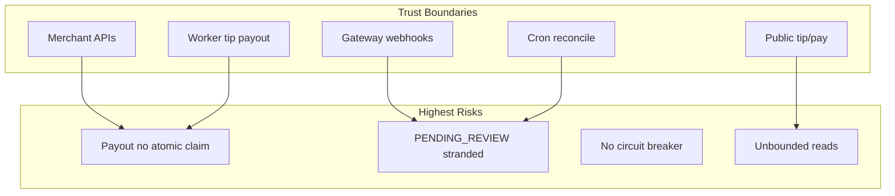

# Audit Mendalam POSTITIK (14 dimensi)

Sumber: graphify (~4085 nodes), eksplorasi kode, skill ponytail-review/audit + product-ui / office-web-ui. Snapshot kode termasuk perbaikan tip-kasir & staff-performance terbaru (belum tentu ter-commit penuh).



---

## Ringkasan eksekutif

| Area | Status | Catatan |
|------|--------|---------|
| Isolasi multi-tenant | Baik | `requireMerchantAuth` + `merchant_id` di sampel route kuat |
| Hak akses granular | Sedang | Capability di API kuat; panel HTML cookie-only; WORKER edge case |
| Rate limiting | Sedang | Ada di login/pay/tip POST; **webhook & tip-payout owner tanpa RL** |
| Payout / antrean | Lemah | Bukan job queue durable; race + ambiguous timeout |
| Circuit breaker | **ABSEN** | Timeout ada; tanpa retry policy / breaker / fallback terkendali |
| Cache multi-tenant | Sedang | Permissions tidak di-cache (aman); settings TTL process-local |
| N+1 / bottleneck | Sedang–tinggi | Checkout catalog overfetch; ledger/staff-perf unbounded; nightly N+1 |
| UI / mobile | Sedang | Shared components bagus; tips & rincian staff lemah di mobile |
| Tests | Baik baseline | Strictness OK; gap di date-range clamp, panel edge, export matrix |
| Over-engineering | Ringan | Duplikat `merchantHomePath`; regex export; strip money ganda |

**Tidak ada bukti IDOR cross-tenant jelas** pada sampel route `[id]`.

---

## 1. N+1 Query & Bottleneck

| Sev | Lokasi | Temuan | Perbaikan |
|-----|--------|--------|-----------|
| P1 | [`src/lib/pos-cart-lines.ts`](src/lib/pos-cart-lines.ts), [`validate-cart.ts`](src/lib/checkout/validate-cart.ts) | Checkout load semua product/addon/cashier | Select hanya ID yang direferensikan |
| P1 | [`staff-performance/route.ts`](src/app/api/merchant/staff-performance/route.ts) | 30 hari item+audit tanpa pagination (setelah hapus 50k) | Aggregate SQL / cursor; detail lazy |
| P1 | [`merchant-ledger-events.ts`](src/lib/merchant-ledger-events.ts) | Banyak scan unbounded lalu merge memori | Cursor + batas tanggal ketat |
| P1 | [`merchant-ledger-nightly.ts`](src/lib/merchant-ledger-nightly.ts) | N+1 per merchant | Batch / set-based |
| P1 | [`tip-webhook.ts`](src/lib/tip-webhook.ts) | Pool tip: `create` per worker | `createMany` |
| P1 | [`products/import`](src/app/api/products/import/route.ts) | Hingga 2k row sequential di TX | Batched upsert |
| P1 | [`gateway-pending.ts`](src/lib/gateway-pending.ts) | Cancel-all: load semua pending | Cursor + concurrency bound |
| P1 | [`pos/reports/raw`](src/app/api/pos/reports/raw/route.ts) | 50k+ nested JSON sekali jalan | Stream/cursor export |
| P2 | dashboard, pos reports, products list, hold-orders, card-reset | Overfetch / banyak aggregate paralel | Narrow select + paginate |

---

## 2. Isolasi Multi-Tenant

- **Baik:** pola `where: { merchant_id, id }` pada merchant APIs yang disampling.
- **P2:** hold-orders GET dengan `pos.access` list semua hold toko (leak antar kasir, bukan antar merchant).
- **P2:** cash movement write memakai cap `ledger.cash.view` (bukan manage terpisah).

---

## 3. Keamanan API & Rate Limiting

| Sev | Temuan | File |
|-----|--------|------|
| P1 | Webhooks (Xendit/Duitku/DOKU): verifikasi signature **tanpa** `rateLimit` | `src/app/api/webhooks/**` |
| P1 | Owner tip payout tanpa RL (worker punya 12/min) | `cashiers/[id]/payout-tip` |
| P1 | Public tip GET tanpa RL (POST ada) | `public/tip/[slug]` |
| P1 | Kill switch prod: `CSRF_GUARD_DISABLED`, `ALLOW_BEARER_SESSION` | `csrf.ts`, `request-auth.ts` |
| P2 | `/api/payment-methods` publik tanpa RL | |
| P2 | Superadmin login RL by email only (tanpa IP) | |
| P2 | Redis down → RL in-memory per instance (fail-soft) | `rate-limit.ts` |

---

## 4. Manajemen Hak Akses

| Sev | Temuan |
|-----|--------|
| **P0** | WORKER hard-lock ke tip-dashboard di [`panel-route-guard.ts`](src/lib/panel-route-guard.ts) **tanpa cek `tip.self`**. Jika owner cabut `tip.self`, `usePageAccess` redirect ke `/dashboard` → panel kirim balik → **loop redirect**. |
| P1 | Panel HTML hanya cek cookie; capability di UI+API (shell leak jika XSS). |
| P2 | SoD checkout+refund hanya warning, tidak block ([`permissions` route](src/app/api/merchant/permissions/route.ts)). |

Kasir Tip Saya (non-WORKER) sudah diperbaiki: boleh `/tip-dashboard`.

---

## 5. Keandalan Antrean Pekerjaan

Payout **bukan** durable queue (claim/lease/DLQ).

| Sev | Temuan |
|-----|--------|
| **Critical** | Timeout → `PENDING_REVIEW` tanpa gateway ID → reconcile butuh ID → stranded ([`payout-core.ts`](src/lib/payout-core.ts)) |
| **Critical** | Dispatch tanpa atomic claim; Duitku risiko duplicate inquiry |
| High | DOKU `AbortError` bisa jadi `FAILED` (bukan ambiguous) |
| High | `disbursement-sync` race webhook vs cron |
| High | Cron tanpa distributed lock; `cron-hit.sh` tanpa timeout curl |
| High | Partial reconcile errors → HTTP 200 → alert cron tidak melihat |
| Medium | Integration callbacks: no backoff/claim/DLQ setelah 10 fail |

---

## 6. Log Audit & Kepatuhan

- POS refund / withdraw / adjust umumnya log Activity / AuditLog.
- **P1 gap:** tip payout (owner & worker) tidak `logActivity`; `TipPayout` kurang initiator untuk owner-on-behalf.

---

## 7. Cache Invalidation Multi-Tenant

- Permissions: query by `(merchant_id, role)` — **tidak di-cache** (aman dari leak).
- App settings / limits: TTL in-process ([`ttl-cache.ts`](src/lib/ttl-cache.ts)) — multi-instance stale ~30s.
- DOKU token cache tidak di-invalidate saat settings berubah; tidak keyed env/credentials.

---

## 8. Ketahanan API Pihak Ketiga

**Circuit breaker: ABSEN.**

Ada: timeout client, reconcile cron, webhook recovery.  
Tidak ada: breaker, retry dengan backoff terstandar, bulkhead, graceful degrade UI saat gateway UNAVAILABLE (Xendit UNAVAILABLE bisa memperlakukan checkout seperti unpaid menuju expire).

---

## 9. UI / Form / Table / Mobile (product-ui + office-web)

**Yang sudah baik:** reuse `MetricCard`, `ExportButtons`, `DateRangePicker`, `ResponsiveDataTable`, `ReportGroupedTable`; staff-performance selaras pola laporan POS.

| Temuan | Dampak |
|--------|--------|
| [`/tips`](src/app/(admin)/tips/page.tsx): tanpa periode + table tanpa mobile cards | Bingung vs laporan lain; mobile scroll saja |
| Staff-perf **rincian** tanpa `renderMobileCard` | Mobile sulit baca |
| Period `<select h-8>` | Touch target &lt; 44px |
| tip-dashboard vs tips vs staff-perf | Tiga “performa tip” mental model berbeda |
| `staff_per_unit` toast/disable qty | Mudah terlewat (friction, bukan bug) |

Tidak menambah komponen baru tanpa perlu; perbaiki dengan pattern existing.

---

## 10. Gap Alur Bisnis

1. WORKER tanpa `tip.self` → redirect loop (P0).
2. Tip payout tanpa audit actor.
3. Payout ambiguous stranded (ops + uang).
4. Staff-perf unbounded setelah remove 50k (risiko toko sibuk 30 hari).
5. Hold orders terlihat antar kasir dalam toko yang sama.

---

## 11. Over-engineering (ponytail-audit)

```
yagni: duplicate merchantHomePath di auth-entry-redirect.ts — import dari panel-route-guard.
yagni: export-format triple regex — cukup flags di call site bila perlu.
shrink: own-scope money strip API+UI ganda — cukup API omit fields.
shrink: ResponsiveDataTable ≈ ReportGroupedTable shell — satukan bila disentuh lagi.
yagni: clampReportDateSpan hanya staff-perf — OK tetap lokal; jangan generalisasi prematur.
```

**net:** ~−80–150 baris jika merge home-path + sederhanakan strip/regex.

---

## 12. Test: longgar & belum ada

| Target | Status | Gap |
|--------|--------|-----|
| Strictness audit | OK | e2e helper `toBeTruthy` di luar scan |
| staff-perf money strip | Ada (integration) | summaryOnly, clamp >30d, 403 no cashier_id |
| panel-route-guard | Ada happy path | WORKER deny /pos; tip.self stripped loop; unauth staff-perf |
| report-date-range | **Kosong** | clamp, inclusiveDaySpan, presets |
| export-format | Ada dasar | formatRowsForReport, edge header |
| payout claim/ambiguous | Lemah relatif risiko | race + PENDING_REVIEW without gateway id |
| webhook RL | N/A sampai RL ditambah | |

---

## Roadmap perbaikan (urutan eksekusi)

Setelah plan disetujui, kerjakan **fase berurutan** (bukan semua sekaligus):

### Fase A — Uang & keamanan (P0/Critical) — 3–5 hari
1. Fix WORKER `tip.self` loop di `panelRouteGuard` + `usePageAccess` (fallback aman / signout).
2. Atomic claim payout + klasifikasi timeout DOKU = ambiguous; jalur recovery manual untuk PENDING_REVIEW tanpa gateway ID.
3. Rate limit webhooks + owner tip-payout + public tip GET.
4. `logActivity` / initiator pada tip payout.

### Fase B — Reliability cron/gateway — 3–5 hari
1. Distributed lock cron; curl timeout; alert pada `errors > 0`.
2. Conditional update terminal disbursement (anti double-apply).
3. Soft degrade: Xendit UNAVAILABLE tidak expire checkout lokal.
4. Docs/env: jangan set CSRF/Bearer kill switches di prod.

### Fase C — Perf hot path — 1 minggu
1. Checkout: select by referenced IDs.
2. Staff-perf: aggregate atau paginate details.
3. Ledger events: batasi/cursor.
4. Tip pool `createMany`; product import batch.

### Fase D — UI/mobile + DRY + tests — 3–4 hari
1. Mobile cards untuk tips + staff rincian; touch target periode.
2. Merge `merchantHomePath`.
3. Unit: `report-date-range`, panel tip.self loop, export matrix, payout claim smoke.

### Fase E — Circuit breaker (hanya jika Fase A–B hijau)
Minimal breaker per provider (open setelah N gagal / window) + metrics; jangan spekulatif sebelum kebutuhan operasi jelas.

---

## Yang tidak diubah di audit ini

- Tidak rewrite arsitektur payment gateway.
- Tidak menambah dependency queue baru (Bull/etc.) di Fase A — claim DB dulu (ponytail).
- Tidak redesign visual brand; hanya consistency & mobile floor.
