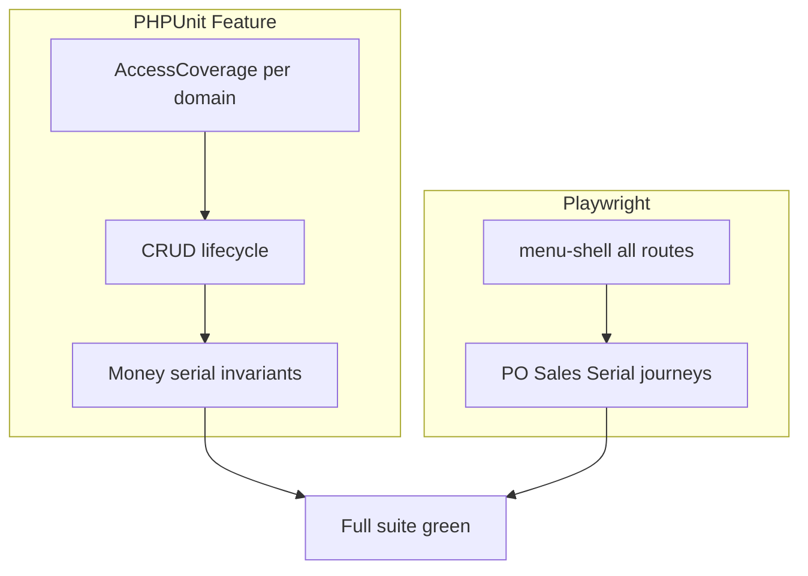

# Full-Menu Deep Test Coverage

## Keputusan terkunci

- Lapisan: **C** — PHPUnit Feature deep + e2e smoke semua list menu + e2e journey (POS existing + PO approve + Sales BO + Serial intake→kasir)
- Target: **semua menu sampai deep** (bukan hanya smoke)
- Eksekusi: **satu program lengkap**, dipecah **5 fase** agar PR/review tidak meledak; DoD = semua fase selesai

---

## Standar “deep” (wajib per tipe menu)

Tidak boleh lolos hanya dengan “index 200”.

| Tipe menu | Minimal deep |
|-----------|----------------|
| **Simple master** (brand/tipe/…) | `view` deny/allow; create/update/delete; validasi field wajib; soft-delete/restore bila ada |
| **Related master** (kategori/grup/warehouse/…) | sama + FK/downstream block inactive |
| **Dokumen uang** (PO, retur, hutang, AR, sales, serial intake, adj/transfer/opname/hpp) | draft→lock/approve/complete; permission tiap aksi; strip harga/nominal tanpa perm; invariant stok/HPP/ledger (`data:verify` style bila modul punya) |
| **Laporan** | access `laporan.*`; filter date; export `laporan.export` deny/allow; payload field kritis (bukan hanya 200) |
| **POS** | access; terminal CRUD; shift start/end reconcile; checkout/void (sudah kuat — pertahankan) |
| **Pengaturan** | user/role CRUD + escalation; settings read/write; import tiap tipe master; reset tiap target + password/`backup_acknowledged` |
| **E2E list** | route load + toolbar/title + table/shell visible (parametrized) |
| **E2E journey** | 1 happy path uang end-to-end dengan assert persistensi API/DB |

Pola yang dipakai ulang: suite `*AccessCoverageTest` yang sudah ada ([`MasterAccessCoverageTest`](syilex/tests/Feature/Master/MasterAccessCoverageTest.php), [`PembelianAccessCoverageTest`](syilex/tests/Feature/Pembelian/PembelianAccessCoverageTest.php), [`InventoryAccessCoverageTest`](syilex/tests/Feature/Inventory/InventoryAccessCoverageTest.php), [`SerialAccessCoverageTest`](syilex/tests/Feature/Serial/SerialAccessCoverageTest.php), [`PosAccessCoverageTest`](syilex/tests/Feature/Pos/PosAccessCoverageTest.php), [`LaporanAnalitikAccessCoverageTest`](syilex/tests/Feature/Reports/LaporanAnalitikAccessCoverageTest.php), [`BusinessModuleAccessCoverageTest`](syilex/tests/Feature/Business/BusinessModuleAccessCoverageTest.php)).

---

## Fase 1 — Tutup gap “none / shallow” berisiko

Menu tanpa suite atau dangkal → buat/isi sampai deep.

| Menu | Kerja konkret |
|------|----------------|
| **Dashboard** | `tests/Feature/Dashboard/DashboardApiTest.php` — auth; widget data shape; gate widget yang butuh `laporan.view` / `stok.view_hpp` (sesuai [`DashboardController`](syilex/app/Http/Controllers/Api/V1/DashboardController.php)) |
| **Tipe / Kategori Customer** | Extend [`CustomerMasterCrudTest`](syilex/tests/Feature/Master/CustomerMasterCrudTest.php) atau `TipeKategoriCustomerCrudTest` — CRUD + access + dipakai customer FK |
| **POS Terminal** | `tests/Feature/Pos/PosTerminalCrudTest.php` — store/update/toggle/delete/list + force-release; akses `terminal.*` |
| **User** | `tests/Feature/Pengaturan/UserCrudTest.php` — CRUD + assign role; lanjutan escalation di [`RoleUserPrivilegeEscalationTest`](syilex/tests/Feature/Role/RoleUserPrivilegeEscalationTest.php) |
| **Role** | `RoleCrudTest` — create/update permission sync + deny escalate |
| **Deposit Supplier** | `SupplierDepositCrudTest` — list/show/create manual/delete + access; reuse strip `hutang.view_nominal`; link ke [`DepositUsageTest`](syilex/tests/Feature/Enhancements/DepositUsageTest.php) |
| **Import Master** | Extend di luar produk-serial: brand/customer/supplier/warehouse (sesuai [`ImportController`](syilex/app/Http/Controllers/Api/V1/ImportController.php) types) — happy + validation + soft-delete restore |
| **Print Barcode** | FE-only: e2e di Fase 4 (dialog buka + preview/shell); BE skip kecuali ada API |
| **Stok list access** | Extend [`InventoryAccessCoverageTest`](syilex/tests/Feature/Inventory/InventoryAccessCoverageTest.php) untuk `stok.view` / `stok.view_hpp` endpoints |
| **Piutang cluster** | Perdalam [`CustomerArBackendTest`](syilex/tests/Feature/Sales/CustomerArBackendTest.php): HTTP matrix `piutang.*` / `pembayaran-piutang.*` / `deposit-customer.*` + strip `view_nominal` |

---

## Fase 2 — Access matrix lengkap semua domain

Lengkapi deny/allow untuk setiap permission aksi dokumen (bukan hanya `view`).

- Extend **PembelianAccess**: deposit-supplier create/delete; hutang show/export/aging
- Extend **InventoryAccess**: stok, kartu-stok, hpp-movement, repack approve, hpp approve
- Extend **MasterAccess**: semua simple/related masters + print-barcode route meta (router/permission string)
- Extend **BusinessModuleAccess**: dashboard, user, role, import, reset targets
- Baru bila perlu: `PenjualanAccessCoverageTest` (sales/retur/piutang/pembayaran/deposit) — hari ini permission lebih tipis dari pembelian
- Pastikan [`MenuRoutePermissionTest`](syilex/tests/Feature/MenuRoutePermissionTest.php) tetap sinkron ≥52 perm unik

---

## Fase 3 — Perdalam suite “medium” ke deep (money/lifecycle)

Fokus invariant, bukan duplikasi CRUD dangkal.

| Area | Perdalam |
|------|----------|
| **Hutang** | create dari PO/serial; partial pay; aging buckets edge; strip nominal |
| **Deposit supplier** | manual deposit → pakai di pembayaran → saldo 0; cannot overdraw |
| **Serial HPP** | approve mengubah `cost_per_unit` + stock card / avg; permission |
| **Repack × serial** | block serial product (sudah rule) + assert 422 eksak |
| **Pergerakan HPP** | filter + entries non–HPP_RESET juga |
| **Produk retail CRUD** | create/update unit/harga; soft delete; list harga gate |
| **Reset Database** | matrix tiap `target` di [`ResetController`](syilex/app/Http/Controllers/Api/V1/ResetController.php): sukses + residual table kosong + refuse non-draft docs |
| **Strip uang terbaru** | retur beli `po.view_harga`; deposit/pembayaran `hutang.view_nominal` (regresi setelah fix sebelumnya) |

---

## Fase 4 — Playwright: smoke semua menu + journey deep

### 4a. Smoke parametrized (ganti docs-walk sebagai gate CI)

Buat [`syilex-frontend/e2e/menu-shell.spec.js`](syilex-frontend/e2e/menu-shell.spec.js):

- Import route list dari [`docs-helpers.js` `ALL_MENU_ROUTES`](syilex-frontend/e2e/docs-helpers.js)
- Per route: login inject → goto → assert title/toolbar + (jika table) `.p-datatable` atau empty-state
- Tag `@smoke`; jalankan serial `workers: 1` (sudah di config)
- **Jangan** andalkan `docs-screenshots.spec.js` sebagai regresi

### 4b. Journey deep (uang)

| Spec | Alur assert |
|------|-------------|
| Extend / baru `po-approve.spec.js` | Buat PO draft → approve → stok/hutang terlihat (API atau UI list) |
| Extend [`penjualan-backoffice.spec.js`](syilex-frontend/e2e/penjualan-backoffice.spec.js) | Sales draft → complete → muncul di list + detail serial bila ada |
| Baru `serial-intake-pos.spec.js` | Serial intake approve → unit tersedia → scan/add di [`pos-checkout`](syilex-frontend/e2e/pos-checkout.spec.js) path → checkout |
| Print barcode | Buka `/app/master/print-barcode` → dialog/preview shell visible |
| Keep | [`pos-checkout.spec.js`](syilex-frontend/e2e/pos-checkout.spec.js), [`auth.spec.js`](syilex-frontend/e2e/auth.spec.js) |

---

## Fase 5 — Gate & ledger cakupan

1. Jalankan `php artisan test` full di `syilex/`
2. Jalankan Playwright: `menu-shell` + journey specs (bukan docs screenshots)
3. Tambah dokumen ringkas [`syilex/docs/testing/menu-coverage-ledger.md`](syilex/docs/testing/menu-coverage-ledger.md): setiap menu → file tes → depth deep
4. CI: pastikan job PHPUnit + Playwright smoke/journey (docs screenshots tetap optional/manual)

---

## Urutan kerja (satu eksekusi, 5 fase)

1. Fase 1 (gap kritis) → hijau filter suite baru
2. Fase 2 (access) → hijau `*AccessCoverage*`
3. Fase 3 (deepen money) → hijau domain filters + full PHPUnit
4. Fase 4 (e2e) → hijau Playwright targeted
5. Fase 5 (ledger + full gate)

Tidak menambah Vitest massal untuk setiap Vue page (ROI rendah); kedalaman bisnis tetap di Feature PHPUnit.

---

## Explicit non-goals

- Mengubah `docs-screenshots` menjadi assertion suite
- Duplikasi 100% e2e untuk setiap CRUD form field
- Coverage % tool-obsessed tanpa ledger menu
