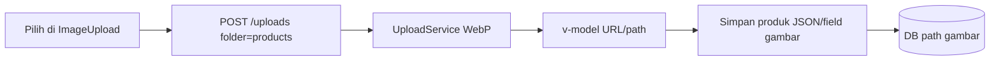

# Unifikasi UI list + ImageUpload Produk (URL) + style Aksi

## 1. RowActionButtons — master dan non-master

Wrapper jarak tombol di kolom Aksi.

**Sudah:** Stock, Shift.  
**Akan:** semua list master + list transaksi (Sales, Transfer, Adjustment, Opname, PO, Retur, Deposit, Pembayaran*, SerialIntake, Promo, PriceChange, Serial*, PosTerminal card, dll.).

Tidak sentuh FormPage isi / laporan khusus / PrintBarcode.

---

## 2. Samakan style `outlined` vs `text` (baru diminta)

**Keputusan dikunci:** standar kolom Aksi list = **`text rounded`** (sudah dipakai transaksi + `RowActionButtons` default).

**Use case:** Brand (sekarang `outlined`) dan Sales (sudah `text`) terlihat sama setelah wrap.

**Yang diubah:** halaman master yang masih `outlined rounded class="mr-2"` → `text rounded` (hapus `mr-2` karena gap dari wrapper).  
**Tidak diubah:** tombol non-Aksi (Toolbar Tambah, Export, filter).

---

## 3. ImageUpload + WebP + BE Produk URL (baru diminta)

### WebP (tetap di BE)
[`UploadService`](syilex/app/Services/UploadService.php): resize → `WebpEncoder` → simpan `*.webp`.

### Alur baru Produk (= Metode / Settings / User)

WebP terjadi **saat pilih file** (eager), bukan saat Simpan produk.

### BE — [`ProdukController`](syilex/app/Http/Controllers/Api/V1/ProdukController.php)
- Validasi `gambar`: dari `nullable|image|file` → **`nullable|string`** (path atau URL).
- Simpan: normalisasi URL → path relatif (pola `UploadService::extractPathFromUrl` / setara Metode).
- Hapus cabang `hasFile('gambar')` + upload di store/update.
- Endpoint `DELETE .../image` tetap untuk clear + hapus file disk (atau selaras dengan clear field + `uploadsApi.delete` dari FE).
- Create/update FE boleh JSON biasa untuk field gambar (cek [`produks.js`](syilex-frontend/src/api/modules/produks.js) — longgarkan FormData-only jika hanya karena file).

### FE — [`ProdukPage.vue`](syilex-frontend/src/views/master/ProdukPage.vue)
- Ganti input file custom → `<ImageUpload folder="products" v-model="..." />` (eager, **tanpa** mode deferred).
- v-model = URL/path string; `gambar_url` preview ikut dari situ.
- Hapus `handleImageSelect` / `FormData.append('gambar', File)`.

**Tidak perlu** mode deferred di ImageUpload jika BE sudah URL.

---

## 4. FormDialog extract — tetap skip

| Untung | Rugi |
|--------|------|
| Reuse multi-tempat (Customer+POS) | 1 pemakai = file ekstra tanpa manfaat |
| List lebih pendek | Boilerplate props/emit; hop debug |

**Keputusan:** tidak extract Brand/Tipe/…; `CustomerFormDialog` tetap.

---

## 5. Bonus
Warehouse `activeFilterCount` include `is_saleable`.

---

## Checklist eksekusi
1. `RowActionButtons` di semua list Aksi relevan.
2. Style Aksi list → `text rounded` globally (master yang masih outlined).
3. BE Produk terima `gambar` string path/URL; drop upload file di controller.
4. FE Produk pakai `ImageUpload` eager `folder="products"`.
5. Fix badge Warehouse.
6. Tidak extract FormDialog massal; tidak tambah deferred mode (tidak dipakai).

## Risiko singkat
- Produk lama yang masih path relatif tetap OK jika FE/Detail sudah pakai `gambar_url` dari API.
- Pastikan folder `products` di [`config/uploads.php`](syilex/config/uploads.php) sudah whitelist (sudah ada).
- Test: upload gambar produk baru, ganti, hapus, edit tanpa ganti gambar.
