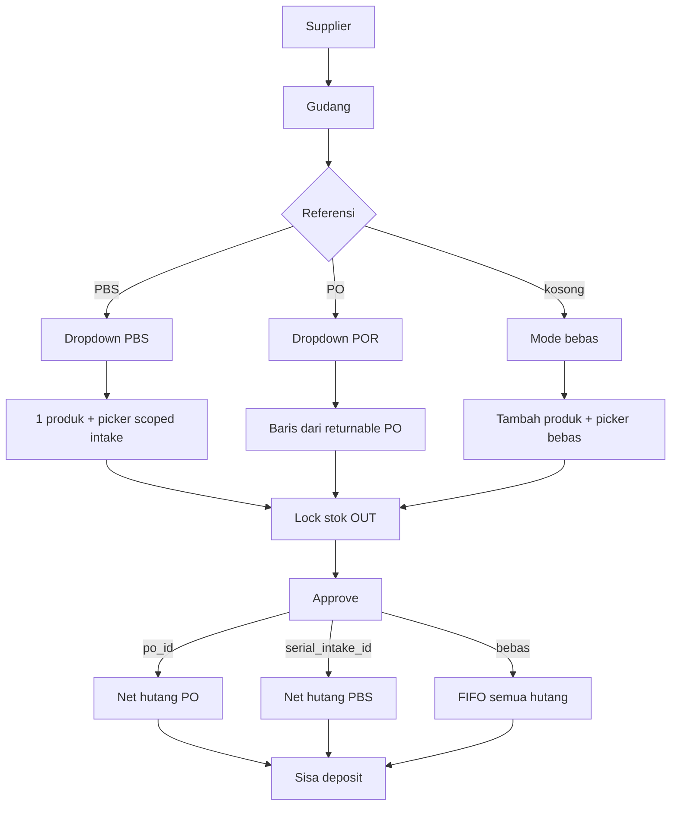

# Link PBS ke Retur Pembelian (B+C)

## Keputusan terkunci

- **B:** field referensi **PBS terpisah** (`serial_intake_id`), saling eksklusif dengan `po_id`; approve net hutang `where('serial_intake_id', …)`.
- **C:** `SerialUnitPicker` di-scope `intake_id` saat PBS terpilih.
- **Bukan A:** tidak mencampur POR+PBS dalam satu dropdown.
- Mode bebas (keduanya null) tetap ada; FIFO hutang supplier tidak berubah.

## Backend

### 1. Schema
- Migration: `doc_purchase_return.serial_intake_id` nullable FK → `doc_serial_intake`, index.
- Model [`DocPurchaseReturn`](syilex/app/Models/DocPurchaseReturn.php): fillable/hidden/relation `serialIntake()`; XOR di validation (bukan DB check constraint kecuali mudah).

### 2. Validasi & actions
- Trait baru (pola [`ValidatesPoHeaderMatch`](syilex/app/Actions/PurchaseReturn/Concerns/ValidatesPoHeaderMatch.php)): intake harus `approved`, `supplier_id` + `warehouse_id` cocok header.
- [`CreatePurchaseReturnAction`](syilex/app/Actions/PurchaseReturn/CreatePurchaseReturnAction.php) / Update: terima `serial_intake_id`; tolak jika keduanya terisi; persist header.
- Detail: tetap 1 baris produk serial + `serial_unit_ids`; validasi unit milik `intake_id` itu dan `tersedia` (perketat path linked PBS di `PreparesSerialReturnDetails` / resolve units).

### 3. Approve
- [`ApprovePurchaseReturnAction`](syilex/app/Actions/PurchaseReturn/ApprovePurchaseReturnAction.php):
  - `po_id` → hutang by `po_id` (existing)
  - `elseif serial_intake_id` → hutang by `serial_intake_id` (mirror)
  - else → FIFO (existing)

### 4. API list & returnable
- List approved intakes filter `supplier_id` + `warehouse_id` (extend [`SerialIntakeController`](syilex/app/Http/Controllers/Api/V1/SerialIntakeController.php) atau endpoint ringan di purchase-returns).
- `GET …/serial-intake/{ulid}/returnable-units` (atau di bawah `purchase-returns/`): produk + unit `tersedia` untuk intake; harga dari avg `harga_modal`.
- Controller create/update rules: `serial_intake_id` nullable, XOR `po_id`.

### 5. Serial picker API (C)
- [`SerialUnitController::available`](syilex/app/Http/Controllers/Api/V1/SerialUnitController.php): pastikan query param `intake_id` sudah dihormati (index sudah punya filter; `available` perlu sama jika belum).
- FE [`SerialUnitPicker.vue`](syilex-frontend/src/components/common/SerialUnitPicker.vue): prop `intakeId` → kirim ke API; masuk dependency reload.

## Frontend

[`PurchaseReturnFormPage.vue`](syilex-frontend/src/views/pembelian/PurchaseReturnFormPage.vue):

- Cascade: supplier + gudang → load **PO list** dan **PBS list** (parallel).
- UI: dua Select opsional — **No. Referensi PO** dan **No. Referensi PBS**; pilih satu clear yang lain + clear detail yang tidak relevan.
- Pilih PBS → prefill 1 detail produk intake, enable picker dengan `intakeId`, disable “Tambah Produk”.
- Clear PBS → kembali mode bebas (atau kosongkan baris prefill).
- Payload create/update kirim `serial_intake_id`.
- Hint singkat: mode PBS men-net hutang dokumen itu; bebas = FIFO.

Copy approve di list page jika masih mengasumsikan hanya PO/deposit penuh — samakan dengan net lalu deposit.

## Tes & docs

- PHPUnit: XOR rejection; create+lock partial units dari PBS; approve credits **hanya** hutang `serial_intake_id` itu (bukan FIFO ke POR lebih tua); excess → deposit; header mismatch ditolak.
- Update singkat [`syilex/docs/modules/serial.md`](syilex/docs/modules/serial.md) / catatan CLAUDE: RPB boleh link PBS.

## File inti

- Migration baru; `DocPurchaseReturn`; Create/Update/Approve PurchaseReturn; Validates* trait; `PurchaseReturnController` (+ optional SerialIntake list); `SerialUnitController::available`; `SerialUnitPicker.vue`; `PurchaseReturnFormPage.vue`; API module FE bila perlu; tests di `tests/Feature/PurchaseReturn/` + serial return test.