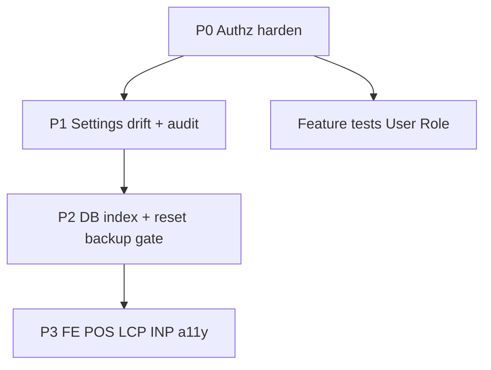

# Plan: Verifikasi Temuan + Perbaikan Bertahap Pengaturan

## Status verifikasi (cek kode, Jul 2026)

Semua finding di bawah sudah di-trace ke file. Label: **CONFIRMED** = bug/gap nyata; **PARTIAL** = benar tapi mitigasi/konteks; **SKIP** = tidak perlu dikerjakan sekarang.

### P0 — Privilege & authz bounds (CONFIRMED)

| # | Temuan | Bukti | Verdict |
|---|--------|-------|---------|
| 1 | Rename `super-admin` lewat API merusak override full-perm | [`RoleController.php`](syilex/app/Http/Controllers/Api/V1/RoleController.php) L161–168: `update(['name'=>...])` dulu, baru cek `$role->name === 'super-admin'` | **CONFIRMED** |
| 2 | `role.create/update` bisa grant permission apa pun (termasuk yang actor tidak punya) | `syncPermissions($validated['permissions'])` tanpa subset check | **CONFIRMED** |
| 3 | `user.create/update` bisa assign role `super-admin` | [`UserController.php`](syilex/app/Http/Controllers/Api/V1/UserController.php) `assignRole` / `syncRoles` tanpa ceiling | **CONFIRMED** |
| 4 | `GET /users/list` & `GET /users/roles` tanpa `can()` | L417–455 — auth Sanctum saja | **CONFIRMED** (dropdown butuh list; gate minimal `user.view` atau permission spesifik caller) |

### P1 — Data integrity / settings drift (CONFIRMED)

| # | Temuan | Bukti | Verdict |
|---|--------|-------|---------|
| 5 | `countUserRecords` omit sales/piutang/serial + bug `orWhere` tanpa group | L307–310 `where(...)->orWhere(...)` bisa leak ke row lain | **CONFIRMED** |
| 6 | `promo.auto_apply` / `show_label` seeded, tidak dipakai `PromoService` | Grep PromoService: kosong | **CONFIRMED** dead |
| 7 | `cost_allocation_mode` seeded + FE store, tidak dibaca Action | SettingSeeder L77; tidak ada consumer | **CONFIRMED** dead |
| 8 | Scheduler `activity_log_*` dipakai middleware, tanpa UI Settings | SettingSeeder L123–124 | **CONFIRMED** |
| 9 | Import template hanya cek `*.create`, bukan `import.master` | [`ImportController::template`](syilex/app/Http/Controllers/Api/V1/ImportController.php) L136 | **CONFIRMED** (ringan) |
| 10 | `settings/public` expose tax/stock/promo tanpa auth | [`api.php`](syilex/routes/api.php) L93 + `publicSettings()` | **PARTIAL** — perlu untuk login/format; **shrink** bukan hapus |
| 11 | Audit log User bisa menyimpan hash password/pin | `User` + `HasAuditLog::logFillable()` | **CONFIRMED** |

### P2 — DB / reset-backup (CONFIRMED / PARTIAL)

| # | Temuan | Verdict |
|---|--------|---------|
| 12 | Index `users.deleted_at`, `activity_log.created_at` | **CONFIRMED NEED** |
| 13 | Reset tidak wajib backup di API | **CONFIRMED** — UI warn saja; gate API `require_backup_token` atau `confirm_backup=true` + recent backup timestamp |
| 14 | Soft-delete user: email unique block reuse | **PARTIAL** — dokumentasikan / anonymize later |
| 15 | Role pivot Spatie integrity | **SKIP** (sudah sound) |

### P3 — FE perf / a11y / POS (CONFIRMED, scope terpisah)

| # | Temuan | Verdict |
|---|--------|---------|
| 16 | LCP: boot tunggu `fetchPublicSettings` + font CDN | **CONFIRMED NEED** |
| 17 | `PosKasirPage.vue` monolit ~3.5k baris; layout 50/50 no stack | **CONFIRMED REFACTOR** |
| 18 | Token di `localStorage` | **PARTIAL** — httpOnly cookie = proyek besar; FE `can()` tetap UX-only |
| 19 | Force ListFiltersSheet ke Settings/Import/Reset | **SKIP** |
| 20 | Rewrite semua ke Laravel Policies | **SKIP** (gaya rumah = inline `can()`) |

### Role seed (CONFIRMED design smell)

- **admin**: `import.master` + hampir semua bisnis, tapi tidak `settings.update` / `user.*` write / `role.*` — inkonsisten.
- **kasir/gudang**: semua `laporan.*` — terlalu luas.

Default perbaikan seeder (tanpa tanya ulang):
- admin: tambah `settings.update`, `user.create/update/delete` (tetap tanpa `role.*` dan `settings.reset`)
- kasir: hanya `laporan.penjualan` (cabut pembelian/keuangan/performa/promo/inventory)
- gudang: `laporan.pembelian` + `laporan.inventory` saja

---

## Pendekatan perbaikan (urutan implementasi)

### Fase P0 — Security (implement first)

File utama: [`UserController.php`](syilex/app/Http/Controllers/Api/V1/UserController.php), [`RoleController.php`](syilex/app/Http/Controllers/Api/V1/RoleController.php), [`RolePermissionSeeder.php`](syilex/database/seeders/RolePermissionSeeder.php)

1. **Role update**: jangan izinkan rename `super-admin`; cek nama **sebelum** update; force-sync all perms tetap.
2. **Permission grant subset**: actor non-super-admin hanya boleh sync permission yang `auth()->user()->can($p)`.
3. **User assign role**: blok assign/sync `super-admin` kecuali actor `hasRole('super-admin')`; non-super tidak boleh assign role yang punya permission di luar miliknya (ceiling sederhana: target role permissions ⊆ actor permissions).
4. **Gate list endpoints**: `users/list` → `user.view` **atau** permission query param yang actor punya (untuk dropdown terminal); `users/roles` → `user.view` atau `user.create|update`.
5. Feature tests: escalate assign super-admin = 403; rename super-admin = 422; grant `settings.reset` by non-owner = 422; list tanpa perm = 403.

### Fase P1 — Settings + audit + delete guard

1. Perbaiki `countUserRecords`: group `orWhere`; tambah `doc_sales`, returns, piutang, serial docs.
2. `HasAuditLog` / User: `logExcept(['password','pin'])` atau exclude di trait override.
3. Settings catalog:
   - Hapus dead: `cost_allocation_mode` dari seeder + FE payload **atau** wire ke logic (default: **hapus/abaikan** — YAGNI).
   - `promo.auto_apply`/`show_label`: wire ke PromoService **atau** drop dari seeder (default: **drop** sampai produk minta).
   - Tambah UI toggle activity-log scheduler di Settings tab Scheduler.
   - Seed `store.url`, `receipt_footer`, `login_background` di SettingSeeder.
4. Shrink `publicSettings()`: store branding + currency/regional/number/text/modules saja; pindah tax/stock/promo/calculation ke endpoint auth.
5. Import template: require `import.master` **dan** entity `*.create`.
6. Activity log + `Log::info` pada role sync & settings bulk write.

### Fase P2 — DB / backup

1. Migration: index `users.deleted_at`, `activity_log.created_at`.
2. Reset API: wajib flag `backup_acknowledged=true` + password (atau require backup download dalam N menit) — UI ResetDatabase sudah punya flow backup; samakan kontrak API.
3. Kencangkan throttle reset (mis. 5/min) — tanpa env kill-switch dulu (YAGNI sampai multi-tenant).

### Fase P3 — FE world-class (setelah P0–P2)

1. Unblock LCP: jangan block `router-view` penuh pada public settings (skeleton + stale cache).
2. Self-host / `font-display: swap` untuk Lato.
3. Split `PosKasirPage.vue` (cart / payment / tabs); responsive stack di &lt;992px.
4. a11y: product tiles `role=button` + keyboard; Reset dialog `label for=`.
5. Token httpOnly: **ditunda** ke epic auth terpisah (catat di debt).

---

## Yang tidak dikerjakan di plan ini (kenapa di-skip)

Bukan karena “tidak penting selamanya”, tapi karena **bukan obat untuk lubang yang baru kita konfirmasi**, atau **terlalu besar dibanding manfaat sekarang**. Plan ini fokus: tutup escalate privilege + settings drift + backup/index, baru polish POS.

### 1. Laravel Policies mass migration — SKIP

**Apa itu?** Pindahkan semua cek `auth()->user()->can('xxx')` di controller ke class Policy Laravel (satu file Policy per model).

**Kenapa tidak sekarang?**
- Lubang nyata ada di **isi aturan** (boleh rename super-admin, boleh grant permission sembarangan), bukan di “bentuk” cek-nya.
- Repo sudah konsisten: cek permission **inline di controller** + `authorizeSimpleMaster`. Mengganti ratusan endpoint ke Policy = refactor besar, risiko regresi, **tanpa menutup bug escalate**.
- Setelah P0 mengunci aturan, Policy opsional nanti kalau ingin standarisasi — bukan prasyarat keamanan.

**Kapan baru perlu?** Tim mau satu gaya Policy di semua modul dan ada bandwidth rewrite + test ulang penuh.

### 2. Sentry/APM — SKIP

**Apa itu?** Layanan pantau error production (Sentry) / performa request (APM: New Relic, Datadog, dll.).

**Kenapa tidak sekarang?**
- Tidak memperbaiki bug authz/settings yang sudah diketahui.
- Ops/docs proyek sudah memilih log file lokal; menambah Sentry = akun, DSN, biaya, privacy review.
- Observability yang cukup untuk P0–P1: activity log role/settings + log login gagal (sudah di backlog ringan P1), bukan full APM.

**Kapan baru perlu?** Ada production traffic, butuh alert error real-time, atau SLA monitoring.

### 3. Force list components ke Settings / Import / Reset — SKIP

**Apa itu?** Memaksa halaman Settings, Import Master, Reset Database memakai pola CRUD list (`DataTableHeader`, `ListFiltersSheet`, `RowActionButtons`) seperti Brand/User.

**Kenapa tidak sekarang?**
- Bentuk halaman **beda**: Settings = form bertab; Import = wizard upload; Reset = aksi berbahaya + backup. Bukan tabel master yang difilter.
- Memaksa komponen list = UI aneh, kerja sia-sia, tidak menambah keamanan/performa.
- User & Role **sudah** selaras pola list — itu yang perlu; tiga halaman lain sengaja custom.

**Kapan baru perlu?** Hampir tidak — kecuali redesain produk mengubah Settings jadi “list of setting rows”.

### 4. GDPR anonymize penuh — SKIP

**Apa itu?** Saat hapus user: hapus/samarkan semua PII (nama, email, telepon), putuskan jejak di transaksi, kebijakan retensi, request “hapus data saya”, dll.

**Kenapa tidak sekarang?**
- Soft-delete + hashed password/pin sudah ada; risiko utama sekarang = **escalate admin**, bukan tuntutan GDPR.
- Anonymize penuh menyentuh sales/piutang/audit (siapa yang create/approve) — desain hukum + produk, bukan patch kecil.
- Plan P1 hanya: jangan log hash password/pin di activity; perbaiki guard hapus user. Cukup untuk privasi operasional dasar.

**Kapan baru perlu?** Ada kewajiban hukum (EU/pasar tertentu) atau klien minta “right to erasure” tertulis.

### 5. Merge semua CalculationService — SKIP

**Apa itu?** Gabungkan `SalesCalculationService`, `PurchaseOrderCalculationService`, `PurchaseReturnCalculationService`, dll. jadi satu service raksasa.

**Kenapa tidak sekarang?**
- Tidak terkait menu Pengaturan / privilege.
- Sudah ada lapisan bersama `DocumentCalculation`; sisanya **beda domain** (sales vs PO vs retur) — sengaja terpisah.
- Merge besar = risiko salah hitung uang (paling mahal di POS) tanpa masalah bisnis yang dibuktikan profiler.

**Kapan baru perlu?** Ada duplikasi bug yang sama berulang di 3 service, atau tim memang ingin satu rumus diskon bersama yang diukur.

---

**Ringkas:** lima item di atas = **proyek samping / utang arsitektur**, bukan perbaikan lubang P0 yang sudah CONFIRMED. Mengerjakannya di plan ini akan menunda tutup escalate privilege.

---

## Definition of done (per fase)

- **P0**: feature tests merah→hijau untuk escalate/rename/list gate; seeder admin/kasir/gudang di-update + catatan migrate existing DB (`php artisan db:seed --class=RolePermissionSeeder` hati-hati production).
- **P1**: settings public mengecil; dead keys hilang; audit exclude secrets; delete guard cover sales.
- **P2**: migration index + reset require acknowledge.
- **P3**: measurable — POS chunk lebih kecil / Lighthouse LCP login turun; tablet stack layout.
