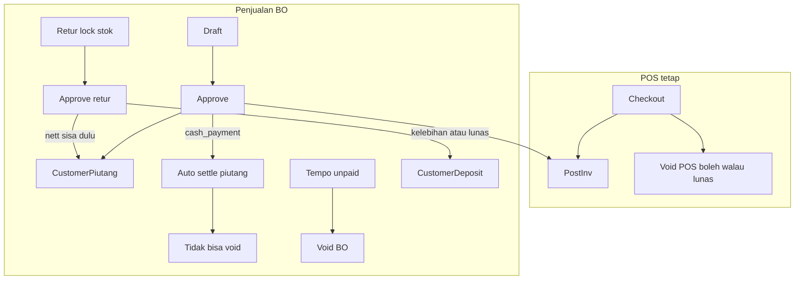

# Penjualan Backoffice — plan final (audit dalam)

## Jawaban void: POS vs BO

| | POS (`source=pos`) | Penjualan BO (`source=manual`) |
|--|--------------------|--------------------------------|
| Bisa void? | **Ya**, jika `completed` dan **belum ada retur** ([`DocSales::canVoid`](syilex/app/Models/DocSales.php)) | **Hanya tempo unpaid penuh** |
| Lunas cash? | Tetap bisa void (stok balik; payment rows tetap di nota `voided`; tidak ada ledger AR) | **Tidak bisa void** — cash approve auto-settle piutang → ada completed payment |
| Sebagian dibayar? | N/A (POS selalu lunas di checkout) | **Tidak bisa void** |
| Sudah ada retur committed? | Tidak bisa void | Tidak bisa void |

**Dikunci BO:**
- Void BO = `source=manual` + `completed` + piutang `unpaid` + `nominal_terbayar=0` + **nol** pembayaran/deposit alloc completed + **nol** retur `lock|approved`
- Cash BO (`cash_payment=true` → auto SettlesCash) → **permanen non-voidable** setelah approve (koreksi salah approve = lewat **retur BO**, bukan void)
- POS `VoidSalesAction` / `pos.void` **tidak diubah**

---

## Keputusan bisnis dikunci (user)

1. **Cash BO tidak voidable** (lihat tabel di atas).
2. **Retur BO approve — netting piutang dulu**, bukan selalu deposit penuh:

| State piutang nota | Efek `nilai_diakui` saat approve retur |
|--------------------|----------------------------------------|
| unpaid / partial | Kurangi sisa piutang (cap di `sisa_piutang`); jika `nilai_diakui` > sisa → sisa piutang dilunasi/dihapus efeknya, **kelebihan** → `CustomerDeposit` |
| paid penuh | Seluruh `nilai_diakui` → `CustomerDeposit` |
| `nilai_diakui` = 0 | Tidak buat deposit; tidak ubah piutang |

Lock retur = stok/serial IN saja (belum sentuh uang). Approve = ledger saja (piutang/deposit), **tidak** ubah HPP.

---

## Prinsip

- POS perilaku & menu tetap; section **Penjualan** terpisah.
- DRY: extract posting; mirror PO/hutang/retur-beli UI; **jangan** `usePosCart`; **jangan** reuse `SettlesCashPayment` mentah (hardcoded hutang) — buat trait/action piutang setara.
- Anti N+1; lock order: **sales → piutang → deposit → stock/product**.
- Settings global wajib (matriks di bawah).
- BO **tidak** menulis `PosCashTransaction`.

---

## Kontrak snapshot draft → approve

| Field | Draft (create/update/calculate) | Approve |
|-------|----------------------------------|---------|
| Harga satuan, unit, qty, biaya, disc5, disc nota override | Snapshot di dokumen; boleh edit | **Pertahankan** — jangan refetch harga produk |
| Promo slot 1–4 + `promo_id` | Preview | **Rebuild** dari `PromoService` waktu approve (anti-fraud) |
| Disc nota dari tipe/kategori customer | Preview | Rebuild dari customer **saat approve** |
| Tax sales %/name, rounding, discount_mode | Recalc tiap save | **Final** dari settings **saat approve** (draft = estimasi) |
| `hpp_at_time`, serial, stock gate | — | Hanya approve |
| Warehouse active+saleable, customer aktif | Validasi save | Re-validasi approve |
| `tanggal`, `tempo_hari`, `tanggal_jatuh_tempo` | Operator / dari `tempo_default` | **Freeze** — ubah `tempo_default` master tidak rewrite draft |

---

## Matriks settings global (WAJIB)

| Setting | BO sales | Piutang/bayar | Retur BO | Void BO |
|---------|----------|---------------|----------|---------|
| `regional.timezone` / `now()` / parseDate | tanggal + nomor YYMM dari **tanggal dokumen** | tgl bayar | tgl lock/approve | void_at |
| `tax.tax_sales_*` | calc | — | valuasi dari snapshot nota | no |
| `tax.tax_purchase_*` | **jangan** | — | — | — |
| `rounding.sales_*` | ya | — | ikut formula valuasi retur | no |
| `calculation.discount_mode` | ya + promo | — | tidak recalc | no |
| `stock.negative_mode` | saat approve | — | lock = stok masuk | restore |
| `promo.enabled` + manual caps | ya | — | — | — |
| `modules.elektronik_enabled` | serial | — | restore serial | restore |
| `prefix.manual_sales` (3 char, mis. `SOM`) | nomor draft | — | — | keep |
| `prefix.sales` / INV | POS only | — | — | — |
| `prefix.sales_return` / RPJ | — | — | + `source` | — |
| `prefix.payment_piutang` (3 char) | — | ya | — | — |
| currency/number/date format | FE formatters | sama | sama | sama |

---

## 1. Schema

### `doc_sales`
- `terminal_id`/`shift_id` nullable (drop FK → nullable → re-add `nullOnDelete`)
- `source` `pos|manual`, default/`backfill` **`pos`**; Checkout tulis `source=pos`
- status: tambah `draft` (prefer **string(20)** atau MODIFY ENUM hati-hati); final BO = `completed`
- tempo/cash fields mirror PO; `approved_at`/`approved_by`
- index `(source, status, tanggal)` (ganti/augment index status+tanggal lama)

### `doc_sales_returns`
- nullable terminal/shift; `source`; status `draft|lock|approved`
- **Backfill** semua retur POS existing → `status=approved`, `source=pos`
- POS create tetap single-shot → langsung `approved`
- `refund_method`: nullable atau nilai `deposit` untuk BO (jangan paksa `cash` palsu)

### Lain
- `master_customer.tempo_default` (+ import/export/form)
- `doc_promo.channel` `pos|penjualan|keduanya` default `keduanya` backfill
- `customer_piutang` (1:1 `sales_id` unique), `doc_pembayaran_piutang*` , `customer_deposit`
- Prefix di SettingSeeder + `getPrefix` + `getPrefixesWithInfo` + SettingsPage defaults; **lock count per prefix** (INV tidak terkunci oleh SO)

### Migrasi MySQL
- Ikuti pola string status seperti serial intake, atau `DB::statement` MODIFY ENUM
- Rollback: dokumentasikan — tidak bisa re-NOT NULL terminal jika ada null BO

---

## 2. Shared posting

`PostsSalesInventory` dari [`CheckoutSalesAction`](syilex/app/Actions/Sales/CheckoutSalesAction.php):
- negative_mode, lock stock/product, decrement, hpp, serial, `StockCard::$skipObserver` + finally
- Checkout: shift assert → concern → `DocSalesPayment` POS + `source=pos`
- Approve BO: concern → piutang (tanpa PosCash)

`qty_base`: jaga **integer** konsisten stok/kartu (serial: qty = count SN). Jangan migrasi inventory ke decimal di v1.

---

## 3. Modul Penjualan

### Permissions
`sales.view|create|edit|delete|approve|void|view_harga` — assign admin; **bukan** kasir.  
RoleController grup Penjualan; RolePage labels; `forgetCachedPermissions()` di seeder; MenuRoutePermissionTest.

### API `/api/v1/sales` — **selalu** filter `source=manual` (IDOR-safe)
Parity PO: index (search/status/customer/warehouse/date/sort/per_page), show, store, update, destroy draft, calculate, products, approve, void.  
Throttle 30/1; **wajib** idempotency header **atau** atomic status guard + Cache lock pada approve/void.

### Actions
| Action | Efek |
|--------|------|
| Create/Update | draft; server calc; no stock |
| Approve | lock sales; rebuild promo; PostInv; `completed`; buat piutang=`grand_total` (bukan fee); cash → settle piutang |
| Destroy | draft only |
| Void | guard tempo unpaid saja; restore stok/serial; batalkan/hapus piutang unpaid; `voided` |

### FE
Menu Penjualan; clone PO pages + `useTransactionList`; gudang `?is_saleable=1`; formatters settings; print hanya completed; **tanpa** `useSessionGuard` (itu shift POS).

### Public struk
- Block draft
- Strip **`hpp_at_time`** dari payload publik (kebocoran COGS hari ini)
- Watermark: LUNAS / BELUM LUNAS / TEMPO dari status piutang; Operator bukan selalu “Kasir”

---

## 4. Piutang + Pembayaran + Deposit

Mirror hutang **penuh**:
- list/summary/aging/by-customer/export + `piutang.view_nominal`
- pembayaran draft→complete; outstanding + available-deposits; cash|deposit alloc
- CustomerDeposit: **manual** edit/delete hanya unused (mirror SupplierDeposit); return-generated **immutable**
- Soft-delete/deactivate customer: block jika outstanding piutang/deposit (mirror SupplierRules)
- History UI: `withTrashed()` customer jika perlu
- Fee metode: AR principal = `grand_total` saja; settle BO tanpa fee POS (atau fee bukan beban piutang)
- Trait settle baru untuk customer (jangan copy-paste hardcode hutang)

`VerifyDataInvariants`: payment check **POS only**; + ledger piutang; + deposit.

HasAuditLog pada header piutang/pembayaran/retur/deposit.

---

## 5. Retur Penjualan BO

- Bukan `ProcessSalesReturnAction`
- draft → lock (stok IN + serial restore) → approve (netting piutang → deposit)
- Hanya nota `source=manual` + `completed`
- Returnable qty / `canVoid` / `sqlSalesReturnedBase` / publicReceipt / GP: **hanya** `lock|approved`
- Valuasi: **invoice-faithful** prorata termasuk biaya/pembulatan dari header tersimpan (dokumentasikan beda dari POS return yang exclude shipping) — UI approve mirror retur beli (`nilai_diakui`, selisih, catatan)
- Permissions `retur-jual.*`

---

## 6. Laporan & Dashboard (akruan vs kas)

| Laporan | BO completed | Returns | Kas vs akruan |
|---------|--------------|---------|---------------|
| Omzet / per nota / per barang / GP / top customer / dead stock | Include | committed | Akruan (tgl nota) |
| Financial disc/biaya/pembulatan + exports | Include setelah **LEFT JOIN** terminal | — | Akruan |
| Kasir performance + export | **Exclude** manual | POS only | — |
| Metode bayar | Tender POS; settle piutang sebagai seri terpisah atau laporan bayar piutang | — | **Kas (tgl settle)** |
| Arus kas | + pembayaran piutang completed | POS refund cash only; BO retur ≠ kas keluar | **Kas** |
| Promo usage | Include + filter channel/source | — | — |
| Shift/kas shift | Auto-exclude null shift | — | — |

Dashboard: omzet include BO; chart bayar = POS tender ∪ settle piutang; `pending_items` + deep link draft penjualan & retur BO (+ perbaiki serial pending jika masih bolong).

---

## 7. Ops: Reset / Truncate / Installer / Nomor

- ResetController + TruncateAllDataSeeder + ResetDatabasePage: tabel AR/deposit/bayar/retur; FK order aman; perbaiki Truncate yang hari ini skip POS tables
- Installer/SettingSeeder: perms + prefixes firstOrCreate
- **Nomor dokumen** dari **tanggal dokumen** (bukan hanya `now()`), agar backdate YYMM benar
- RESTORE_DRILL checklist AR

---

## 8. Concurrency

Lock order: sales FOR UPDATE → validate status → stock/product → piutang → deposit.  
Return lock: lock sales + returnable committed qty.  
Idempotency + status guard anti double-approve.

---

## 9. Docs & tests

Update CLAUDE (dual path; sales BO draft/completed/voided; retur status `lock` bukan “locked”; hapus mitos kolom `retur_status`), ARCHITECTURE, ONBOARDING, API_DOCS, RESTORE_DRILL.

Tests: snapshot/approve; cash non-voidable; tempo void; retur netting matrix; committed-only aggregates; serial; settings; LEFT JOIN exports; invariants; POS regression; MenuRoutePermission; makePosSale/makeBoSale terpisah.

Playwright: smoke menu/permission saja (bukan full AR E2E).

---

## Endpoint inventory (parity pembelian)

**Sales BO:** CRUD, calculate, products, approve, void  
**Piutang:** index, summary, aging-summary, by-customer, export, show  
**Pembayaran piutang:** outstanding, available-deposits, CRUD draft, complete  
**Deposit customer:** summary, by-customer, usage, manual CRUD  
**Retur jual:** CRUD, returnable-details, lock, approve  

FE clone: PurchaseOrder*, SupplierHutang*, PembayaranHutang*, SupplierDeposit*, PurchaseReturn*.

---

## Out of scope v1

- Ubah UX kasir/shift/hold cart
- Gabung retur kasir ke BO
- Piutang untuk nota POS historis
- Enforce `promo.auto_apply` / `show_label` / `cost_allocation_mode`
- Credit limit customer
- User↔warehouse assignment
- Attachment nota
- Fix GrossProfit `qty` vs `qty_base` (jangan perburuk; tulis data benar)

---

## Urutan implementasi

1. Migrasi + backfill + prefixes + tempo + promo channel  
2. PostsSalesInventory + POS hijau  
3. Penjualan CRUD/approve/void + permissions/FE  
4. Piutang + pembayaran + deposit + invariants  
5. Retur BO + netting matrix  
6. Promo channel wiring  
7. Laporan LEFT JOIN + Dashboard + ArusKas + Reset + struk  
8. Import tempo + docs + tests  

## YAGNI

Reuse `useTransactionList`, Detail*, formatters, notify, pola form PO/hutang/retur. Jangan invent factory framework, session guard BO, atau Vitest baru (unit FE = runner existing).
