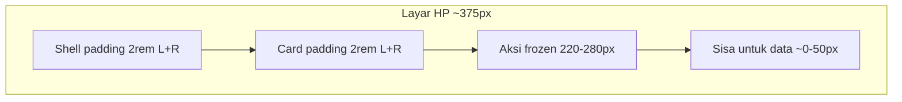

# Rencana perbaikan Penjualan + UX + Mobile (v3)

**Keputusan terkunci**
- **A Promo:** otomatis menang (Disc 1–4); Disc 5 manual.
- **B Faktur:** helper `exportSalesInvoicePdf` khusus; field existing.
- **Mobile:** perbaiki **global dulu** (padding + Aksi + filter), bukan redesign 41 halaman satu-satu.

---

## Kenapa HP terasa sempit / berantakan (akar masalah)

Di layar ~375px:

```text
Lebar layar          375px
- padding shell L+R  64px   (2rem + 2rem di layout-main-container)
- padding .card L+R  64px   (2rem + 2rem)
= sisa konten       ~247px
```

Lalu tabel list menambah kolom **Aksi frozen** 220–280px yang menempel di kanan → kolom data tinggal “strip” tipis. Itu bukan karena konten terlalu banyak teks, tapi **chrome makan lebar**.



**File akar**
- [\_main.scss](syilex-frontend/src/assets/layout/_main.scss): `padding: 6rem 2rem 0 2rem`
- [\_utils.scss](syilex-frontend/src/assets/layout/_utils.scss): `.card { padding: 2rem }`
- [\_responsive.scss](syilex-frontend/src/assets/layout/_responsive.scss): ≤991 hanya atur sidebar; **masih** `padding-left: 2rem` — tidak ada aturan kepadatan konten
- ~41 list page: `Column frozen` + `min-width: 220–280px`

---

# BAGIAN MOBILE (detail penuh)

Breakpoint utama app: **991px** (sama arah Tailwind `lg` 992). Login pakai 1100px — beda; akan diselaraskan di HP.

## M1 — Padding global (P0, impact terbesar)

**Tujuan:** konten dapat lebar lagi tanpa ubah tiap page.

1. Tambah token di [variables/\_common.scss](syilex-frontend/src/assets/layout/variables/_common.scss):

```scss
:root {
  --page-pad-x: 2rem;
  --page-pad-top: 6rem;
  --card-pad: 2rem;
}
@media (max-width: 991px) {
  :root {
    --page-pad-x: 0.75rem;   /* 12px */
    --page-pad-top: 5rem;    /* topbar tetap aman */
    --card-pad: 1rem;        /* 16px */
  }
}
```

2. Wire ke `_main.scss` / `_utils.scss` / `_responsive.scss` (ganti angka hardcode 2rem).
3. Di ≤991: pastikan **kiri dan kanan** padding ikut token (sekarang responsive hanya utak-atik `padding-left`).

**Hasil kira-kira di 375px:** sisa konten ~375 − 24 − 32 ≈ **319px** (naik dari ~247px) sebelum Aksi.

**Jangan:** kurangi padding desktop; jangan ubah `p-4` per-page dulu.

---

## M2 — Kolom Aksi list di HP (P0)

**Sebab:** frozen kanan + banyak tombol icon.

**Strategi ponytail (urutan):**

1. **CSS global ≤991** (1 tempat, ~41 page ikut):
   - Nonaktifkan perilaku frozen / biarkan scroll penuh, **atau**
   - Paksa kolom Aksi `min-width` kecil (~4.5–5.5rem) + sembunyikan label jika ada
2. Komponen opsional `RowActions.vue`: icon-only, `gap-1`, migrasi bertahap halaman prioritas (Sales, PO, Promo, Piutang, Adjustment).
3. **Jangan** rewrite 41 file di hari pertama.
4. Menu “⋯” (overflow actions) = fase 2 jika masih ramai.

**Acceptance:** di HP, minimal 1–2 kolom data (nomor/tanggal/status) tetap terbaca tanpa horizontal scroll ekstrem.

---

## M3 — Toolbar / filter / search (P1)

**Sebab:** `w-40` DatePicker/Select + search `w-72`/`w-80` di area ~247–319px → wrap berantakan.

**Perbaikan shared:**

1. [DataTableHeader.vue](syilex-frontend/src/components/common/DataTableHeader.vue): search `w-full max-w-full sm:w-72` (hapus default kaku).
2. Konvensi filter (class `.list-filters` atau kecil `ListFilters` wrapper):
   - Container: `flex flex-wrap gap-2 w-full`
   - Kontrol: `w-full sm:w-40` (bukan `w-40` polos)
3. Sentuh dulu pola Sales / PO / Promo / Piutang / laporan yang sering dipakai; sisanya ikut saat disentuh modul.

**Jangan:** bikin filter drawer kompleks di v1.

---

## M4 — Dialog & DetailDialog (P1)

**Sebab:** width fixed `500–900px` tanpa `max-width: 95vw`; form `grid-cols-2` di HP sempit.

1. [DetailDialog.vue](syilex-frontend/src/components/common/DetailDialog.vue): `width: min(prop, 95vw)`, `maxWidth: 95vw`; isi meta `grid-cols-1 sm:grid-cols-2`.
2. Dialog form (Customer, Produk, master): `grid-cols-1 md:grid-cols-2`; width `min(750px, 95vw)`.
3. Saat buat `ProdukFormDialog` — ikut aturan ini dari awal.

---

## M5 — Form transaksi (Sales / PO) (P1–P2)

Header grid sudah `grid-cols-1 md:…` — OK.

**Masalah:** tabel baris produk di dalam `.card` + section `p-4` lagi + kolom `min-width` besar.

**v1:**
- Di ≤991: kurangi padding section dalam card (`p-2` / `p-3`)
- Biarkan horizontal scroll tabel (tidak paksa stack semua kolom — mahal)
- Setelah M1+M2, evaluasi apakah masih perlu stack field kritis di luar tabel

**Template acuan:** SalesFormPage, PurchaseOrderFormPage → pola sama ke form lain belakangan.

---

## M6 — Kartu statistik / laporan (P2)

Banyak `grid-cols-2 md:grid-cols-4|5|7` → 2 kolom KPI dengan currency panjang wrap jelek.

**v1 selektif:** modul yang sering dibuka di HP (Arus Kas, Dashboard deposits, summary penjualan) → `grid-cols-1 sm:grid-cols-2 md:grid-cols-N`.

Dashboard KPI sudah lebih baik (`col-span-12` di bawah `sm`) — biarkan, hanya rapikan padding lewat M1.

---

## M7 — Login HP (ikut item login + mobile)

Selain hapus lengkung:
- Di &lt;1100 (atau samakan ke 992): form panel **full-bleed**, tanpa radius kiri + bayangan “setengah desktop”
- Pertahankan `form-inner max-width: 400px` agar form tidak melebar aneh di tablet landscape

---

## M8 — Acceptance checklist mobile (verifikasi manual)

Di Chrome DevTools **375×812** dan **390×844**:

| Cek | Lulus jika |
|-----|------------|
| List Sales/PO/Promo | Nomor + status kebaca; Aksi tidak makan >~40% lebar |
| Filter toolbar | DatePicker full-width wrap rapi, tidak overflow horizontal halaman |
| Form Sales draft | Field header 1 kolom; tabel line bisa di-scroll tanpa “tercekik” padding |
| Detail dialog | Muat di viewport, tidak potong kanan |
| Login | Tidak ada lengkung/shadow aneh; form center nyaman |
| Spacing | Jarak tepi layar terasa ~12px, card dalam ~16px — tidak “dalam bingkai tebal” |

Dark mode: cek contrast setelah padding berubah (tidak ubah warna).

---

## Urutan kerja MOBILE (dalam keseluruhan plan)

Mobile dikerjakan **awal** karena global & mempengaruhi semua verifikasi UI berikutnya:

1. **M1** token + padding shell/card  
2. **M2** CSS Aksi HP  
3. **M7** Login curve + full-bleed  
4. **M3** DataTableHeader + filter convention (halaman prioritas)  
5. **M4** DetailDialog / dialog width  
6. Fitur penjualan (promo overlap → tempo-cash → Get Promo → faktur → ProdukFormDialog)  
7. **M5–M6** form detail padding + stats selektif  

---

# BAGIAN FITUR (ringkas — detail v2 tetap berlaku)

## 1. Tempo ↔ Cash
Dua arah FE+BE; settle = `cash_payment`; normalize draft ilegal; PO di luar v1.

## 2. Promo list overlap
Hanya `GET /promos`; one-sided filters; update JSDoc; tests.

## 3. Get Promo
Flag `rebuild_promos`; map `details`; `nama_promo`; gate `promo.enabled`; Disc 5 aman; header 1–2 dari tipe customer.

## 4. `exportSalesInvoicePdf`
Alamat customer; terbilang baru; watermark; SalesPage only; skip bank/Salesman/SO/Bonus.

## 5. ProdukFormDialog
Create-only; `makeVisible(['id'])`; blok serial di Sales/PO; gate `produk.create`; host Sales/PO/Adjustment.

---

## Prinsip

- **Ponytail mobile:** 2–3 file SCSS dulu > 41 edit Vue
- **Office / product UI:** restrained; tidak redesign “mobile app” penuh; padat & terbaca
- Anti N+1 & reuse tetap untuk bagian API/fitur
- `ponytail:` jika CSS unfreeze Aksi punya batasan PrimeVue — catat di kode

## Di luar v1

- Card-list redesign semua halaman
- Overflow menu “⋯” di semua list
- POS kasir mobile (permukaan beda)
- Mirror tempo-cash ke PO
- Salesman/SO/Bonus/bank rekening
- Unfreeze manual 41 file tanpa CSS global
