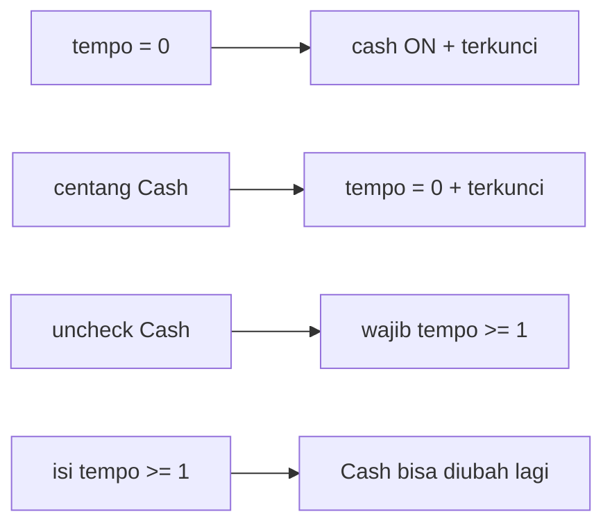

# Rencana perbaikan Penjualan + UX (baca sederhana)

**Keputusan terkunci**
- **A Promo:** otomatis menang (timpa Disc 1–4; Disc 5 tetap manual). Tombol Get Promo = preview sama dengan hasil approve.
- **B Faktur:** helper baru `exportSalesInvoicePdf` (bukan generik `exportDocumentPdf`). Layout mirip contoh PDF, **pakai field yang sudah ada** (tanpa Salesman/SO/Bonus baru).

**Catatan:** `graphify-out/graph.json` belum ada — audit sudah lewat kode langsung. Setelah kerja besar, boleh `/graphify --update` nanti.

---

## Apa yang salah / kurang hari ini (ringkas)

| Area | Sekarang | Seharusnya |
|------|----------|------------|
| Tempo & Cash | Bisa bebas (tempo 0 tanpa cash, cash tanpa tempo 0) | Dua arah saling kunci |
| List promo | Filter “harus penuh di dalam tanggal” → promo Jul 1–30 hilang di filter Jul 1–20 | Filter **overlap** (bersinggungan = muncul) |
| Diskon form jual | Tidak ada promo otomatis sampai approve | Tombol **Get Promo** di draft |
| Print faktur | PDF generik “Penjualan” | Faktur kredit/tunai mirip contoh |
| Tambah produk | Tombol di atas form saja | Plus di pojok baris (UX tab-friendly) |
| List HP | Kolom Aksi frozen lebar menutupi data | Aksi ringkas / tidak makan layar |
| Login | Panel kiri lengkung (`border-radius`) | Lurus / tanpa lengkung mengganggu |

---

## 1. Tempo ↔ Cash (dua arah)

**Aturan bisnis (FE + BE sama):**



| Aksi user | Efek |
|-----------|------|
| Tempo jadi `0` | Cash otomatis ON, checkbox Cash **disabled** |
| Centang Cash | Tempo jadi `0`, input Tempo **disabled** |
| Uncheck Cash | Wajib isi tempo ≥ 1 dulu (atau auto set 1 / `tempo_default` customer jika > 0) |
| Ubah tempo ≥ 1 | Cash tidak lagi dipaksa; user boleh uncheck |

**File utama**
- FE: [`SalesFormPage.vue`](syilex-frontend/src/views/penjualan/SalesFormPage.vue) — watcher dua arah + UI disable
- BE: [`ManualSalesController`](syilex/app/Http/Controllers/Api/V1/ManualSalesController.php) validasi + [`CreateManualSalesAction`](syilex/app/Actions/Sales/CreateManualSalesAction.php) — tolak kombinasi ilegal (tempo=0 tanpa cash; cash dengan tempo>0)

**Edge case**
- Ganti customer → isi `tempo_default`; jika 0 → paksa cash; jika >0 dan cash sedang ON → tanya/ikuti aturan cash (cash tetap = tempo 0)
- Edit draft lama yang “ilegal” → saat buka form, normalisasi + simpan ulang harus lulus validasi baru
- **Tidak** ubah PO/pembelian di v1 (beda modul) kecuali user minta mirror

**Test kecil:** 1 feature test validasi kombinasi tempo/cash.

---

## 2. Filter tanggal list Promo (bug)

**Sebab:** backend containment di [`PromoController.php`](syilex/app/Http/Controllers/Api/V1/PromoController.php) ~L51–60.

**Ganti jadi overlap:**

```text
tanggal_mulai <= date_to
AND (tanggal_selesai IS NULL OR tanggal_selesai >= date_from)
```

Contoh: promo 1–30 Juli + filter 1–20 Juli → **muncul**.

FE [`PromosPage.vue`](syilex-frontend/src/views/master/PromosPage.vue) sudah kirim `date_from`/`date_to` — tidak perlu ubah besar.

**Test:** 1 case overlap + 1 case di luar rentang.

---

## 3. Tombol Get Promo di form penjualan

**Masalah:** draft `calculate` tidak rebuild promo; baru di approve → total bisa berubah.

**Solusi (ponytail):**
1. Extensi `POST /sales/calculate` dengan flag `rebuild_promos=true` (atau body yang sama dipakai approve).
2. Tombol **Get Promo** di toolbar detail → panggil calculate rebuild → isi Disc 1–4 + badge nama promo per baris.
3. Disc 5 + header Disc 3 tetap manual.
4. Approve tetap rebuild lagi (sumber kebenaran = DB promo).

**Tampil UI:** badge “Promo: …” di baris; slot 1–4 setelah Get Promo jelas bertanda otomatis (boleh masih editable untuk eksperimen, tapi approve menimpa — dokumentasikan di UI singkat).

**Anti N+1:** `PromoService::findBestPromo` sudah batch/pola existing — jangan query promo per line di controller baru; reuse service.

**Skipped:** `_override_promo` ala POS — tambah kalau operator benar-benar butuh kunci diskon manual.

---

## 4. Faktur PDF — `exportSalesInvoicePdf`

**Baru:** helper di composable (mis. extend [`useExportPdf.js`](syilex-frontend/src/composables/useExportPdf.js) atau file sibling `useSalesInvoicePdf.js`) — **khusus penjualan manual**.

**Isi layout (adaptasi contoh, field existing):**
- Header toko (nama, alamat, telp dari settings)
- Judul: **FAKTUR KREDIT** (tempo) / **FAKTUR TUNAI** (cash)
- Kepada Yth: nama + **alamat** customer
- Meta: No Faktur, Tanggal, Term (`N HARI, tgl JT` atau `TUNAI`), Gudang
- Tabel: Kode, Nama, Qty, Satuan, Harga, Disc, Jumlah (tanpa Bonus)
- Ringkasan: Subtotal, Disc nota, biaya, DPP, PPN, Total
- **Terbilang** (helper angka→teks ID, reuse jika sudah ada)
- 3 kolom tanda tangan: Pembeli / Pengirim / Admin
- Footer cetak: tanggal + user
- Optional: baris “Nomor PO” dari `notes` jika diawali pola sederhana — tanpa kolom DB baru

**Backend anti N+1:** di [`ManualSalesController`](syilex/app/Http/Controllers/Api/V1/ManualSalesController.php) eager-load `customer:…,alamat` (dan field yang dipakai print).

**Panggil dari:** [`SalesPage.vue`](syilex-frontend/src/views/penjualan/SalesPage.vue) (ganti export sekarang). Form boleh tombol print juga untuk completed.

**Edge case print**
- Draft → jangan print / atau watermark DRAFT
- Voided → watermark VOID
- Piutang unpaid/partial → bisa watermark TEMPO / BELUM LUNAS (konsisten struk online)
- Tanpa alamat → nama saja
- Pajak 0 → sembunyikan baris DPP/PPN
- Banyak baris → multi-page AutoTable + nomor halaman

**Skipped:** Salesman, Nomor SO, Bonus, Karton/Berat/Volume (belum ada di domain).

---

## 5. Quick-add produk di baris form

**Pola reuse:** mirror [`CustomerFormDialog.vue`](syilex-frontend/src/components/common/CustomerFormDialog.vue) → ekstrak/buat **`ProdukFormDialog.vue`** dari logic Dialog di [`ProdukPage.vue`](syilex-frontend/src/views/master/ProdukPage.vue) (jangan duplikasi form penuh 2x).

**UX (office + product UI, restrained):**
- Di kolom aksi baris produk: ikon `+` kecil (bukan hero button pair)
- Tab dari Autocomplete kosong → fokus aksi add tetap nyaman
- Setelah save: inject produk baru ke opsi + set ke baris aktif

**Scope v1 (ponytail):** form yang paling sering butuh SKU baru:
1. SalesFormPage
2. PurchaseOrderFormPage
3. AdjustmentFormPage

Lainnya (Transfer, Opname, dll.) pakai dialog yang sama belakangan — 1 komponen, banyak pemakai.

Permission: `produk.create` — sembunyikan tombol jika tidak boleh.

---

## 6. List mobile — kolom Aksi tidak menutupi data

**Sebab:** `Column frozen` + `min-width` 220–280px di hampir semua list.

**Solusi minimal (satu pola, banyak halaman):**
1. Buat komponen kecil **`RowActions`** (atau class CSS shared): tombol icon-only, gap ketat, `min-width` ~120–140px.
2. Di viewport sempit (CSS/`matchMedia`): **matikan frozen** ATAU sembunyikan label, hanya icon; data tetap scroll horizontal dengan aksi tidak makan 40% layar.
3. Anchor visual: pola list existing PrimeVue + shell SIPOS (restrained, bukan card redesign total).

**Prioritas halaman:** Sales, PO, Promo, Piutang/Pembayaran, Adjustment — lalu samakan sisanya yang copy-paste frozen.

Tidak perlu mobile card layout penuh di v1 (YAGNI).

---

## 7. Login — hilangkan lengkungan kiri

Di [`Login.vue`](syilex-frontend/src/views/pages/auth/Login.vue) `.form-panel`:
- Hapus / set `border-radius: 0` (atau hanya radius kecil konsisten desktop split).
- Cek dark/light tetap rapi; jangan sentuh brand panel kecuali perlu.

---

## Urutan kerja (aman & cepat)

1. Login curve (1 file, cepat)
2. Promo date overlap (BE + 1 test)
3. Tempo↔cash FE+BE + test
4. Get Promo (calculate flag + tombol + badge)
5. `exportSalesInvoicePdf` + load alamat
6. `ProdukFormDialog` + 3 form
7. RowActions / unfreeze mobile pada list prioritas

---

## Prinsip teknis (wajib di tiap PR kecil)

- **Ponytail:** reuse dulu; jangan invent factory/framework; tandai shortcut dengan `ponytail:` jika sadar batasan.
- **UI:** product-ui-design / office-web — restrained, tidak purple glow, tidak 4 stat palsu; ikon aksi tenang.
- **DB/API:** eager-load; 1 calculate dengan rebuild; index tanggal promo sudah ada — jangan N+1 di Get Promo.
- **Test:** 1 test per aturan uang/status (tempo-cash, promo overlap, calculate rebuild).

---

## Di luar scope v1

- Mirror tempo↔cash ke PO
- Field Salesman / SO / Bonus / Karton
- Override promo permanen per line
- Redesign semua list jadi card mobile
- Rebuild graphify (opsional setelah merge)
