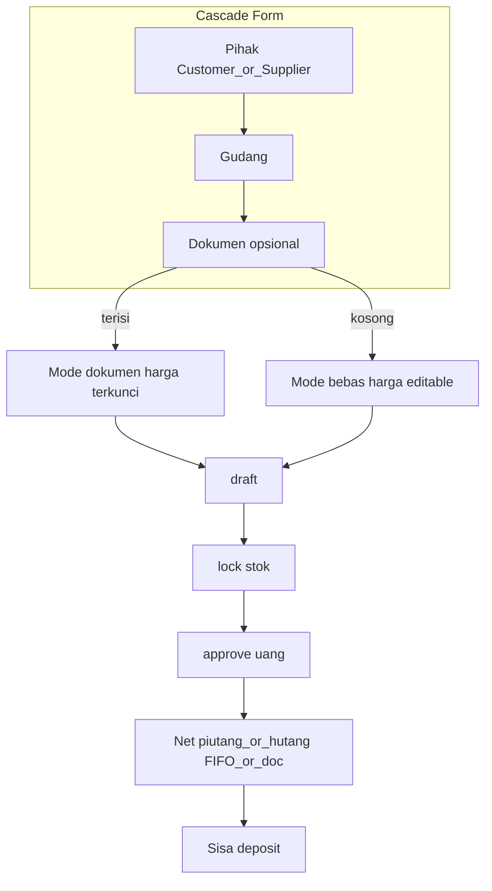

# Unifikasi Retur Beli & Retur Jual (BO)

## Keputusan produk (terkunci)

| # | Keputusan |
|---|-----------|
| Sumber | Keduanya mode **dokumen opsional** (kosong = bebas) |
| Cascade | 1 pihak → 2 gudang → 3 dokumen (PO / nota jual) |
| Harga | Dokumen terisi → terkunci dari dokumen; bebas → editable |
| Approve | Net dulu (piutang/hutang), sisa → deposit |
| Stok | Jual **IN** / beli **OUT** (tidak disamakan) |
| Serial | `SerialUnitPicker` di kedua form |
| Lifecycle | draft → lock → approve |

**Default teknis (agar tidak ambigu):**
- Approve **mode bebas**: FIFO net semua piutang/hutang terbuka milik customer/supplier terpilih (tertua dulu); sisa → deposit. Mode dokumen: net hanya hutang/piutang dokumen terkait (PO / nota), sama perilaku sales BO hari ini.
- Serial **mode bebas jual**: picker unit `terjual` (filter gudang + customer bila ada jejak sale); lock → `tersedia` + stock IN. **Bukan** memakai `available` (tersedia) seperti retur beli.
- Serial **mode dokumen jual**: picker terbatas unit terjual dari baris nota tersebut.
- Free return **tidak** menambah `sqlSalesReturnedBase` / status retur per-nota (hanya return terikat `sales_id`). Dokumentasikan di UI/help singkat.

---

## Fase 1 — Cascade dokumen (quick win + fondasi UX)

### Retur pembelian
- Backend: [`PurchaseOrderController::list`](syilex/app/Http/Controllers/Api/V1/PurchaseOrderController.php) terima `warehouse_id` + `byWarehouse`; select/visible `warehouse_id`.
- FE: [`PurchaseReturnFormPage.vue`](syilex-frontend/src/views/pembelian/PurchaseReturnFormPage.vue) — PO disabled sampai supplier+gudang; `getList({ supplier_id, warehouse_id })`; watch gudang reload/clear PO; validasi server PO.supplier/warehouse = header.

### Retur penjualan
- API baru/extend: list returnable sales filter `customer_id` + `warehouse_id` (hari ini hanya search).
- FE: [`SalesReturnFormPage.vue`](syilex-frontend/src/views/penjualan/SalesReturnFormPage.vue) — cascade Customer → Gudang → Nota (opsional, showClear); nota disabled sampai 1+2; clear dokumen clear detail.

---

## Fase 2 — Mode bebas retur jual (schema + actions)

**Gap kritis hari ini:** `sales_id` / `sales_detail_id` NOT NULL; Create/Update/Lock/Approve + `SalesReturnCalculationService` selalu `findOrFail` sale.

1. Migration: nullable `doc_sales_returns.sales_id`, `doc_sales_return_detail.sales_detail_id`.
2. Controller rules dual-path di [`BackofficeSalesReturnController`](syilex/app/Http/Controllers/Api/V1/BackofficeSalesReturnController.php):
   - Linked: `sales_id` + `sales_detail_id` + qty returnable (existing).
   - Free: `customer_id` + `warehouse_id` wajib; `sales_id` null; detail produk + harga (+ serial); tidak wajib `sales_detail_id`.
3. Actions: branch di Create/Update/Lock/Approve ([`app/Actions/SalesReturn/*`](syilex/app/Actions/SalesReturn/)).
4. Calculation: `calculateFree` / validate free (harga client + HPP avg_cost / serial cost) di [`SalesReturnCalculationService`](syilex/app/Services/SalesReturnCalculationService.php).
5. Lock free: stock IN tanpa `revertSoldUnits($salesId)`; path serial baru untuk unit terjual terpilih.
6. Approve free: FIFO `CustomerPiutang` by `customer_id` lalu excess `CustomerDeposit` (mirror linked yang sudah net per-nota).

Endpoint bantu FE (pola retur beli): list produk / last price bila belum ada di sales-returns API.

---

## Fase 3 — Net hutang di retur beli (simetri uang)

**Gap:** [`ApprovePurchaseReturnAction`](syilex/app/Actions/PurchaseReturn/ApprovePurchaseReturnAction.php) full `SupplierDeposit`; `SupplierHutang` belum punya `nominal_retur` / `recordReturnCredit` (piutang sudah punya).

1. Migration `supplier_hutang.nominal_retur`.
2. `SupplierHutang::recordReturnCredit` + formula sisa; update [`VerifyDataInvariants::checkHutangLedger`](syilex/app) agar subtract `nominal_retur`.
3. Rewrite approve: PO-linked → net hutang PO; free → FIFO hutang supplier; excess → deposit (boleh 0).
4. Copy UI/API: [`PurchaseReturnPage.vue`](syilex-frontend/src/views/pembelian/PurchaseReturnPage.vue), success message controller, [`SalesReturnPage.vue`](syilex-frontend/src/views/penjualan/SalesReturnPage.vue) (copy deposit penuh sudah salah vs backend).
5. Surface `nominal_retur` di [`SupplierHutangPage.vue`](syilex-frontend/src/views/pembelian/SupplierHutangPage.vue) bila kolom piutang sudah menampilkan ekuivalen.

---

## Fase 4 — Serial + form money UX

- Tambah `retur-jual.create` (dan view/update bila perlu) ke allowlist [`SerialUnitController::available`](syilex/app/Http/Controllers/Api/V1/SerialUnitController.php) **atau** endpoint picker khusus status `terjual` untuk retur jual (lebih tepat untuk free/linked jual).
- FE jual: ganti chip → `SerialUnitPicker` (mode terjual / scoped nota).
- FE beli: sudah picker; pastikan cascade WH konsisten dengan picker.
- Samakan layout kolom: Produk, Satuan, Returnable/Max, Qty, Harga, Subtotal, Serial + ringkasan kanan (sudah mulai di sales form).

---

## Fase 5 — Laporan, menu lain, dokumen, tes

| Area | Dampak | Tindakan |
|------|--------|----------|
| `ReportHelperService::sqlSalesReturnedBase` | Free return tidak masuk status per-nota | **Sengaja**; jangan join paksa. Catat di CLAUDE/docs |
| `SalesProductReportController` / export per-barang | INNER JOIN sales → free hilang | LEFT JOIN / union agar qty retur bebas tetap terhitung di laporan barang |
| `ReturPatternReportController` | Hitung semua sales return lock/approved | OK; volume naik — tanpa ubah wajib |
| Laporan pembelian | Tidak include purchase return money | OK |
| Kartu stok `SALES_RETURN` / `PURCHASE_RETURN` | Tipe tetap | Update note lock saja |
| Dashboard pending sales return | Tetap | Opsional: pending purchase return (parity, bukan blocker) |
| CustomerDeposit / SupplierDeposit pages | Relasi `retur_id` OK | Copy jangan asumsikan deposit = full `nilai_diakui` |
| POS `ProcessSalesReturnAction` | `source=pos` terpisah | **Jangan sentuh** |
| Permissions `retur-jual.*` / `retur-beli.*` | Cukup | Tidak merge menu |
| AppMenu / router | Dua menu tetap | OK |
| Seeders nomor RPB/RPJ | OK | — |
| PHPUnit | `BackofficeSalesReturnTest`, `PurchaseReturnCrudTest`, serial return tests, `VerifyDataInvariants*` | Rewrite assert deposit; tambah free+FIFO+cascade list |
| E2E | `penjualan-backoffice.spec.js`, docs screenshots retur | Update smoke cascade |
| `CLAUDE.md` / `docs/modules/serial.md` | Dok approve & serial retur-jual | Update |

---

## Gap baru yang diantisipasi (dari audit)

1. **Schema FK sales return** — blocker mode bebas jual (Fase 2).
2. **Hutang tanpa `nominal_retur`** — blocker simetri approve beli (Fase 3).
3. **Double-count stok** jika SN diretur bebas lalu nota lain juga retur line yang sama — mitigasi: free serial hanya unit `terjual` belum pernah di-return; linked tetap cap `sales_detail_id`; status unit mencegah double IN.
4. **Serial allowlist** — `retur-jual` belum di `SerialUnitController::available`.
5. **Approve copy** di list jual/beli menyesatkan (full deposit).
6. **PO list tanpa warehouse** — penyebab “PO kadang tidak muncul / salah gudang” (Fase 1).
7. **Mismatch PO.warehouse vs header** bisa tersimpan hari ini — tutup validasi create/update.
8. **Laporan per-barang** drop free sales return jika tidak diubah JOIN.
9. **Void sale** hanya dilindungi return dengan `sales_id` — free return tidak memblok void nota lain (acceptable; dokumentasikan).
10. **Deposit volume turun** setelah net hutang — tes & UI deposit/hutang harus disesuaikan, bukan bug.

---

## Urutan implementasi disarankan

1. Fase 1 cascade (beli+jual filter) — nilai UX cepat, risiko rendah.
2. Fase 3 net hutang beli — simetri uang, schema hutang.
3. Fase 2 free jual (migration + actions + calc + approve FIFO).
4. Fase 4 SerialUnitPicker + polish form.
5. Fase 5 reports/docs/tests/e2e.

---

## File inti

**Backend:** `PurchaseOrderController`, `BackofficeSalesReturnController`, `PurchaseReturnController`, `ApprovePurchaseReturnAction`, `ApproveSalesReturnAction`, `Create/Update/Lock*SalesReturn*`, `SalesReturnCalculationService`, `SupplierHutang`, `CustomerPiutang`, `SerialUnitController`, `VerifyDataInvariants`, migrations baru.

**Frontend:** `PurchaseReturnFormPage.vue`, `SalesReturnFormPage.vue`, `PurchaseReturnPage.vue`, `SalesReturnPage.vue`, `SupplierHutangPage.vue`, `salesReturns.js`, `purchaseOrders.js`, `SerialUnitPicker.vue` (reuse).

**Tes:** `BackofficeSalesReturnTest`, `PurchaseReturnCrudTest`, serial return tests, invariant tests, PO list filter test.
