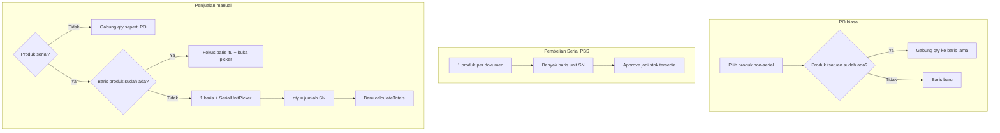

# Rencana UX: PO, Pembelian Serial, Penjualan Manual

## Verifikasi dua arah (sudah dicek)

### Plan → codebase (20 klaim)

Hampir semua klaim gap **TRUE**. Nuansa penting:

| Klaim | Hasil |
|-------|--------|
| PO exclude serial, merge, forceSelection, Simpan=`length===0`, calculate kirim blank, tanpa hint/inline error | TRUE |
| PBS: FE wajib kode; Generate `KI-*` ditolak BE; supplier tanpa `<small>`; menu "Purchase Order Serial"; 1 produk banyak unit | TRUE (Generate = **bug nyata**) |
| Sales: merge **sudah** skip serial; tanpa picker; tanpa branch serial di select; emptyDetail/edit tanpa SN; validate tanpa SN; products() ikut elektronik; approve gagal tanpa SN; PDF attach sudah ada | TRUE — **Sales sudah partial serial-aware** (bukan zero) |

Yang **STALE** di rencana lama: “tambah skip-merge serial” — sudah ada. Yang diganti: skip pasif → **redirect + picker + union SN**.

### Codebase → plan (gap yang kurang)

| Severity | Temuan | Masuk rencana? |
|----------|--------|----------------|
| **must** | Serial select set `qty=0` → `calculate`/`getPromos` kena rule BE `qty gt:0` → toast. Retur hindari: **jangan calculate** sampai SN dipilih | Ya |
| **must** | `loadSales` belum map `serial_unit_ids` / `is_serial` / `_uid` (BE show sudah `attachSerialUnitsToSale`) | Ya (perjelas) |
| nice | Bind `warehouseId` + `@change` supaya ganti gudang sync qty (mirror retur) | Ya (1 baris) |
| ignore | Retur **block** duplicate vs PO/Sales **merge** — domain beda, jangan unify | — |
| ignore | Test BE kode_internal nullable sudah ada; ubah FE tidak pecah test | — |
| ignore | Tempo/cash header-only; promo ikut gate calculate | — |

---

## Keputusan terkunci

- **Non-serial (PO + Sales):** tetap **auto-merge qty**.
- **Serial penjualan:** satu baris per produk + SN; **bukan** clone PBS intake.
- **PBS:** dokumen terpisah; perbaiki Generate KI; jangan picker jual.
- **Tidak** shared util merge lintas form.
- Copy retur untuk **struktur UI**; harga jual dari **POS** (`harga_jual`), **bukan** `harga_modal` retur.

---

## 1. PO biasa — [PurchaseOrderFormPage.vue](syilex-frontend/src/views/pembelian/PurchaseOrderFormPage.vue)

Sudah: BE `getProducts` → `where('is_serial', false)`.

| Item | Apa |
|------|-----|
| Hint | “Produk serial lewat Pembelian Serial” + link `inventory-serial-intake-create` bila `serialEnabled` |
| Simpan | `:disabled` bila `!details.some(d => d.product_id)` |
| Calculate | Filter baris tanpa `product_id` di payload calculate (save tetap `syncDetailProducts`) |
| Inline error | `<small>` di produk/qty |
| Merge | Tetap gabung qty + toast |

Tidak ubah BE PO.

---

## 2. Pembelian Serial (PBS) — [SerialIntakeFormPage.vue](syilex-frontend/src/views/inventory/SerialIntakeFormPage.vue)

1. **Kode internal optional** di `validate()`; placeholder “Kosong = auto”. **Hapus tombol Generate** (mengisi `KI-\d+` yang ditolak [HandlesSerialUnits.php](syilex/app/Actions/SerialIntake/Concerns/HandlesSerialUnits.php)).
2. `<small>` untuk `errors.supplier_id`.
3. [AppMenu.vue](syilex-frontend/src/layout/AppMenu.vue): label **“Pembelian Serial”** (list page sudah benar).

Tidak tambah scan-massal / layout mobile.

---

## 3. Penjualan manual — [SalesFormPage.vue](syilex-frontend/src/views/penjualan/SalesFormPage.vue)

Mirror struktur [PurchaseReturnFormPage.vue](syilex-frontend/src/views/pembelian/PurchaseReturnFormPage.vue); harga seperti [usePosCart.js](syilex-frontend/src/composables/usePosCart.js).

**Sudah ada:** merge skip serial; payload bisa kirim `serial_unit_ids`; BE approve + PDF attach.

**Dikerjakan:**

1. State: `_uid`, `is_serial`, `serial_unit_ids` di `emptyDetail` + **edit `loadSales` wajib restore** dari show (attach BE sudah siap).
2. `onProductSelect` serial:
   - Produk sudah di grid → buang baris current, expand baris existing, toast.
   - Baru → `UNIT`, `qty=0`, `serial_unit_ids=[]`, expand; **jangan panggil `calculateTotals`** (sama retur).
3. Expansion + `SerialUnitPicker` (`:productId="product.ulid"`, `:warehouseId="form.warehouse_id"`).
4. `onSerialChange`: ids; `qty = units.length`; `harga_per_unit` dari **`harga_jual`** (rata-rata unit terpilih, sederhana); lalu `calculateTotals`.
5. Qty UI: Tag “N unit” (bukan InputNumber bebas).
6. `validate`: SN ≥ 1 dan qty === length; toast konkret.
7. `mergeAllDuplicateLines`: non-serial = sum qty; bila 2 baris serial sama produk (draft lama) → **union SN** + qty = |set| (bukan sum qty).
8. `getPromos` / calculate: jangan kirim baris serial `qty < 1` atau tanpa SN.

PDF: tidak perlu kerja besar.

---

## 4. Pesan user

| Situasi | Pesan |
|---------|--------|
| PO / Sales non-serial duplikat | “Produk + satuan sudah ada — qty digabung…” |
| Sales serial sudah di grid | “Produk serial sudah ada di baris X — pilih unit di situ” |
| Sales tanpa SN | “Pilih minimal 1 unit serial” |
| PO | Hint menu PBS |

---

## 5. Urutan kerja

1. PBS (Generate/kode/supplier/menu)  
2. SalesForm (picker + calculate gate + edit restore)  
3. PO polish  

---

## 6. Uji manual

- **PO:** duplikat → gabung qty; blank + simpan prune; serial tidak di AC.  
- **PBS:** simpan tanpa kode → OK; tidak ada Generate yang 422; error supplier terlihat.  
- **Sales:** pilih serial → picker tanpa toast calculate; pilih lagi → 1 baris; qty = SN; edit draft restore SN; approve OK; non-serial merge qty.  
- **PDF:** SN tampil di bawah nama.
