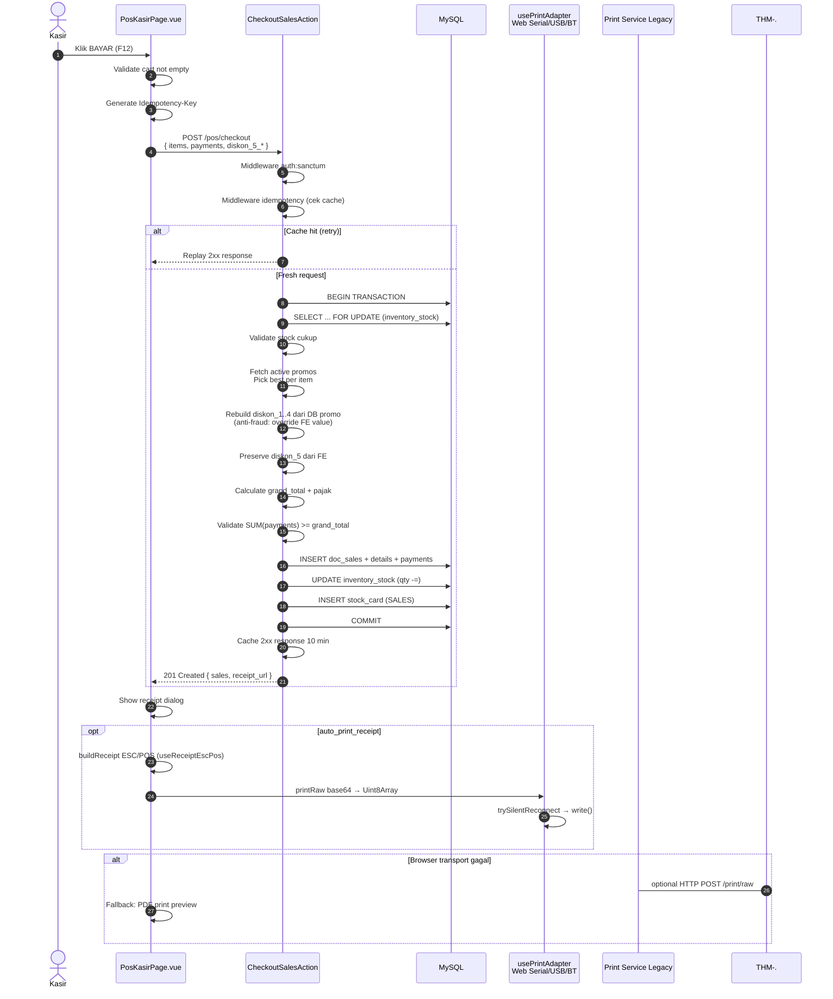
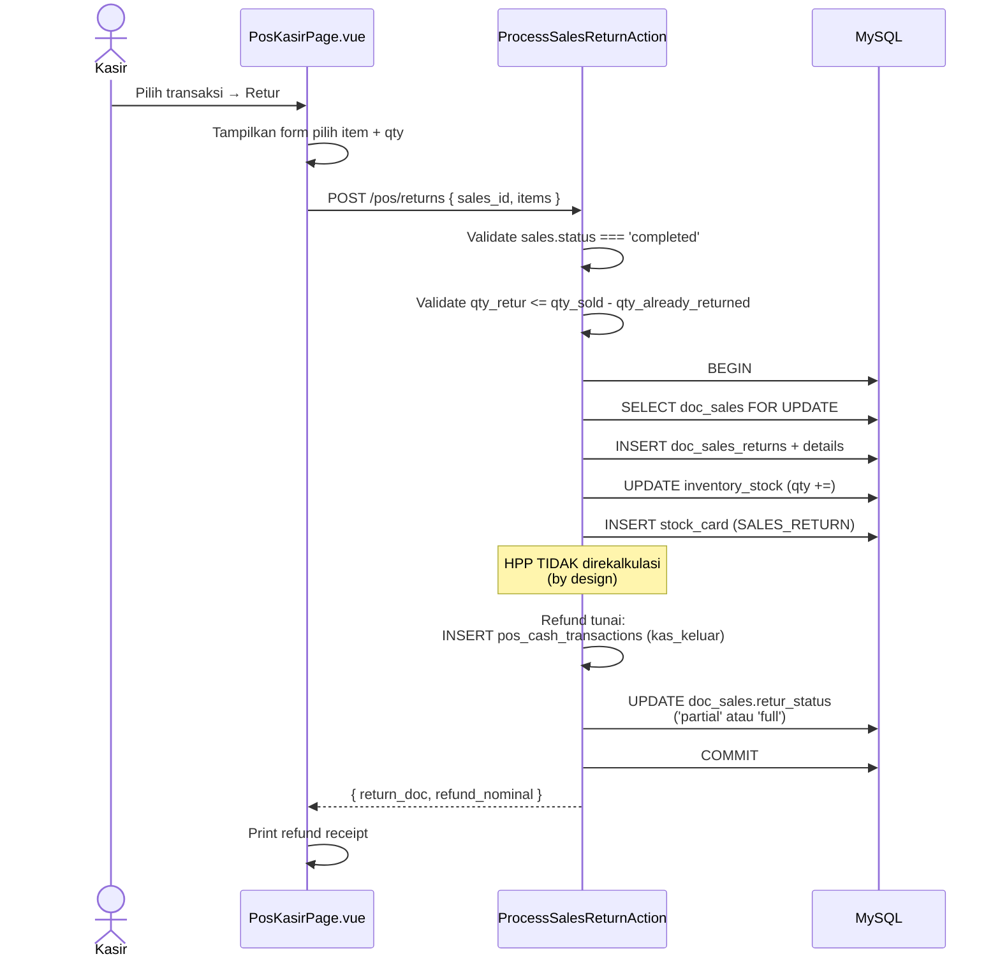
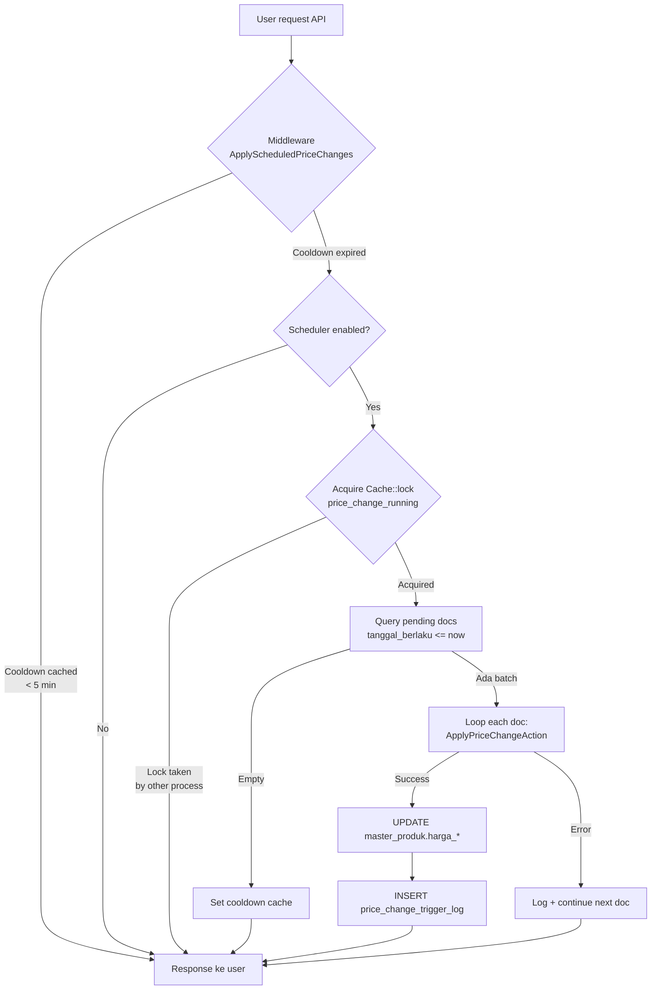
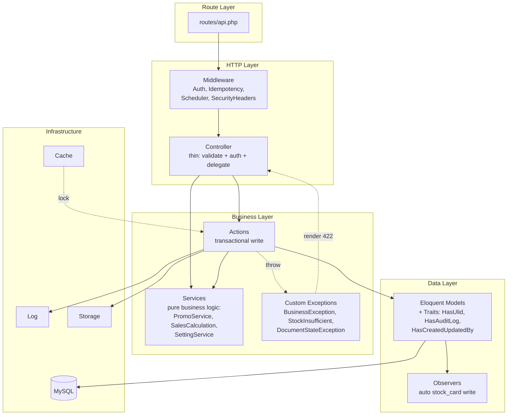
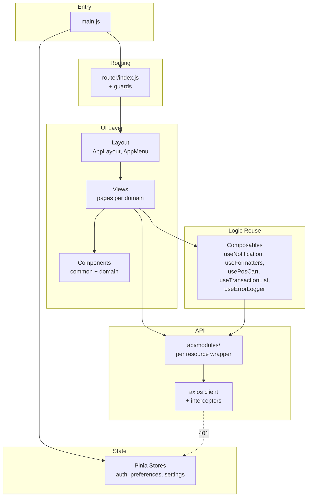
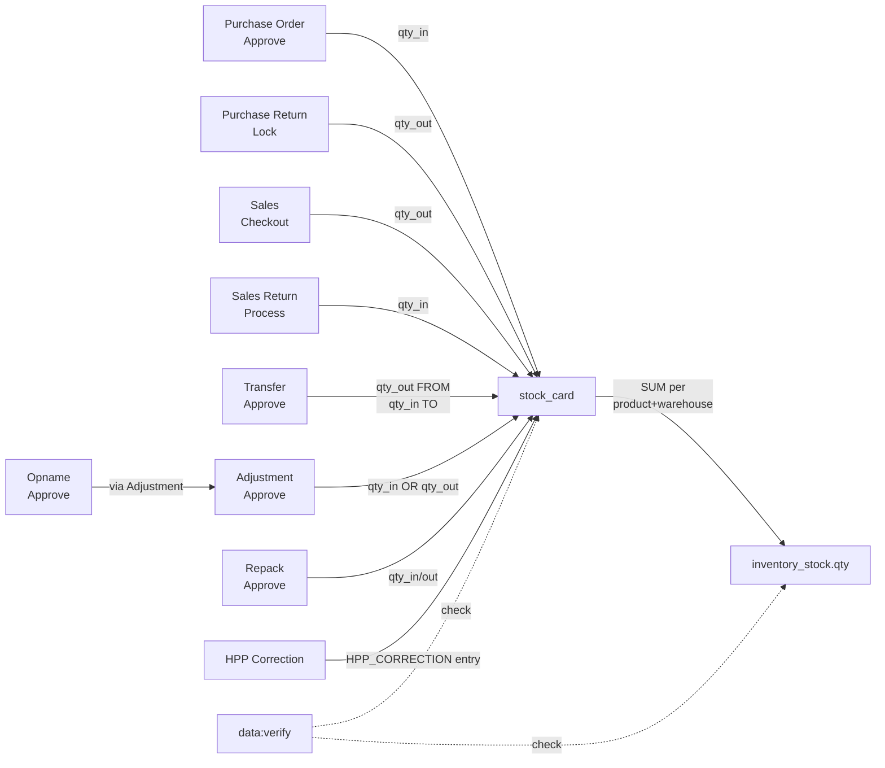
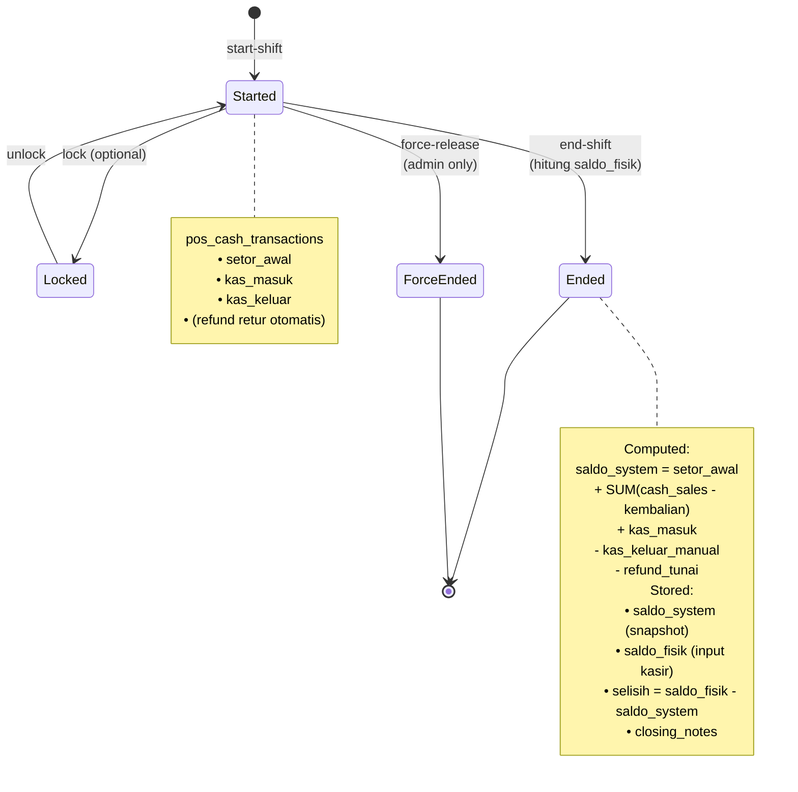
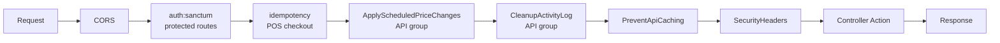
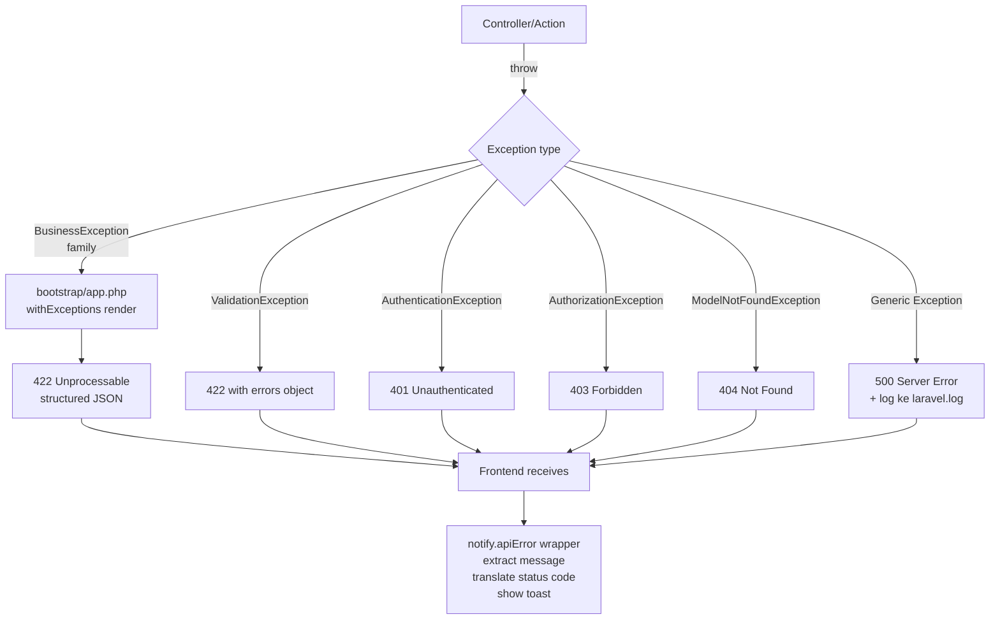

# Architecture — SIPOS

Flow diagram + high-level arsitektur sistem. Diagram pakai Mermaid (auto-render di GitHub/GitLab/VSCode Mermaid Preview).

---

## 1. System Overview

```mermaid
graph LR
    subgraph Client
        BRW[Browser SPA<br/>Vue 3 + Vite]
        THM[Browser ESC/POS<br/>Web Serial / USB / BT]
        LEG[Print Service Legacy<br/>Python :5123]
    end

    subgraph Server
        APP[Laravel 12 API<br/>PHP 8.2]
        MW[Middleware Pipeline<br/>Auth, Idempotency,<br/>Scheduler Triggers]
        DB[(MySQL 8)]
        FS[(storage/app/public)]
        LOG[(Laravel Log)]
    end

    subgraph Monitoring
        HC[GET /health]
        DV[data:verify CLI]
        CE[/client-errors]
    end

    BRW -->|Bearer Token| APP
    BRW -->|Uint8Array ESC/POS| THM
    BRW -.->|fallback optional| LEG
    APP --> MW
    MW --> DB
    MW --> FS
    MW --> LOG
    CE --> LOG
    HC --> DB
    HC --> FS
    DV --> DB
```

**Key points:**
- Backend API stateless (Sanctum token in header)
- Print thermal via **browser Web API** (Chrome/Edge); legacy Python service opsional di `:5123`
- Frontend bisa deploy terpisah (CDN) atau dari `public/` Laravel
- No external cloud dependency (offsite backup adalah opsional di Tier 7)

---

## 2. Checkout Flow (POS)

End-to-end dari klik "Bayar" sampai struk tercetak:



**Key invariants:**
- Semua write dalam 1 transaction
- Stock locked via `lockForUpdate` sebelum decrement
- `stock_card` entry per (product, warehouse) selalu match mutation
- Idempotency cache prevent double-charge di network retry

---

## 3. Return Flow (Retur Sales)



**Catatan:**
- Void ≠ Retur: Void = batal total sebelum completion, Retur = pengembalian barang setelah completed
- Return hanya bisa kalau sales status = completed (tidak bisa kalau voided)
- Void tidak bisa kalau sudah ada return (harus un-retur dulu, tapi tidak ada flow un-retur — harus manual DB)

---

## 4. Price Change Auto-Apply (Middleware-Triggered)



**Keunggulan:** tidak butuh cron. Scheduler jalan on-demand saat ada traffic user. Ramah shared hosting.

---

## 5. Layered Architecture (Backend)



**Prinsip:**
- **Thin controller:** <100 LOC per method. Cuma validate + authorize + `Action::execute()`
- **Action per operasi:** 1 action = 1 business verb (Checkout, Void, Return, Approve, Cancel, Lock, Unlock)
- **Service untuk shared logic:** kalau dipakai >1 action, pindah ke service
- **Exception-driven:** throw custom exception → auto render ke 422 dengan message jelas

---

## 6. Frontend Structure



**Router guard:**
```js
router.beforeEach((to, from, next) => {
    if (to.meta.requiresAuth && !authStore.isLoggedIn) return next('/login');
    if (to.meta.permission && !authStore.can(to.meta.permission)) return next('/forbidden');
    next();
});
```

---

## 7. Stock Ledger Invariant



**Rule iron-clad:**
1. Setiap mutation `inventory_stock` ada entry `stock_card` dengan delta yang sama
2. Setiap entry `stock_card` punya `transaction_type` + `transaction_no` (referensi dokumen asal)
3. HPP recalc hanya di `PURCHASE_RECEIVE` dan `ADJUSTMENT_IN`
4. Invariant verifiable: `SUM(qty_in - qty_out) per (prod, wh) === inventory_stock.qty`

Verifikasi via:
```bash
php artisan data:verify
```

---

## 8. HPP Calculation Flow

```mermaid
graph TD
    A[Purchase Order Receive<br/>atau Adjustment IN] --> B{current avg_cost exists?}
    B -->|Tidak / avg_cost=0| C[New avg_cost = harga_beli_baru]
    B -->|Ya| D[totalQty = current_stock + incoming_qty]
    D --> E{totalQty > 0?}
    E -->|Tidak| F[avg_cost tetap current]
    E -->|Ya| G[new_avg_cost =<br/>(current_stock * current_avg + incoming_qty * incoming_cost)<br/>/ totalQty]
    G --> H[UPDATE master_produk.avg_cost]
    C --> H
    F --> I[Return]
    H --> I
```

**Division-by-zero guard** penting karena adjustment bisa bikin stock 0 dulu baru IN lagi.

---

## 9. Shift Lifecycle



---

## 10. Domain Reference Quick Map

| Domain | Controller | Main Actions | Key Tables |
|--------|------------|--------------|------------|
| Sales | `PosController`, `SalesReportController` | `CheckoutSalesAction`, `VoidSalesAction`, `ProcessSalesReturnAction` | `doc_sales*`, `pos_cash_transactions`, `pos_terminal_shifts` |
| Purchase | `PurchaseOrderController` | `CreatePurchaseOrderAction`, `ApprovePurchaseOrderAction` | `doc_purchase_order*`, `supplier_hutang`, `history_harga_beli` |
| Purchase Return | `PurchaseReturnController` | `LockPurchaseReturnAction`, `CancelPurchaseReturnAction` | `doc_purchase_return*` |
| Adjustment | `AdjustmentController` | `ApproveAdjustmentAction`, `CancelAdjustmentAction` | `doc_adjustment*` |
| Transfer | `TransferController` | `ApproveTransferAction` | `doc_transfer*` |
| Repack | `RepackController` | `ApproveRepackAction` | `doc_repack*` |
| Opname | `StockOpnameController` | `ApproveStockOpnameAction` | `doc_stock_opname*`, `doc_adjustment` (auto-link) |
| Price Change | `PriceChangeController` | `ApplyPriceChangeAction`, `ApprovePriceChangeAction`, `CancelPriceChangeAction` | `doc_price_change*`, `price_change_trigger_log` |
| Promo | `PromoController` | via `PromoService` | `doc_promo*` |
| HPP Correction | `HppCorrectionController` | `ApproveHppCorrectionAction` | `doc_hpp_correction*` |
| Pembayaran Hutang | `PembayaranHutangController` | `CompletePembayaranHutangAction` | `doc_pembayaran_hutang*`, `supplier_hutang`, `supplier_deposit` |

---

## 11. Middleware Pipeline



Order penting — scheduler middleware setelah auth supaya ada `auth()->id()` untuk logging.

---

## 12. Error Handling Pipeline



---

## 13. Further Reading

- [CLAUDE.md](CLAUDE.md) — AI agent guide
- [API_DOCS.md](API_DOCS.md) — endpoint reference
- [DEPLOY.md](DEPLOY.md) — production deploy
- [RESTORE_DRILL.md](RESTORE_DRILL.md) — disaster recovery
- [ONBOARDING.md](ONBOARDING.md) — new dev setup
- Actions: `app/Actions/` — baca source per flow yang mau dimengerti
